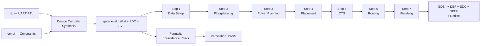

# UART ASIC Flow — RTL-to-GDSII Implementation

A complete Synopsys-based RTL-to-GDSII implementation of an **8-bit UART** IP on a **SAED32 (32 nm, 9-metal)** process. The flow takes the UART RTL and drives it through logic synthesis, formal verification, and a full physical implementation in **IC Compiler II** — from data setup to a final, streamed-out **GDSII** layout with the full set of handoff artifacts (netlist, DEF, SDC, SPEF).

The design is a single-clock UART with configurable parity (`par_en` / `par_typ`), an 8-bit parallel transmit datapath, a 10-bit receive datapath, and a `/8` internal baud-rate divider. The system clock `sys_clk` is constrained to a **10 ns (100 MHz)** period.

> The RTL for the complete UART design (both RX and TX) is gathered under `ASIC_FLOW/rtl/` so this flow is self-contained. The individual UART_RX and UART_TX blocks each have their own separate simulation and FPGA flows elsewhere in the project — no unified full-UART sim/FPGA flow exists. See [`rtl/README.md`](rtl/README.md).

## Flow Overview

## Repository Structure

| Directory | Role |
|-----------|------|
| [`common/`](common/README.md) | Shared infrastructure: project variables, library/corner selection, design setup, MCMM configuration, common procedures and helper functions. |
| [`rtl/`](rtl/README.md) | UART RTL sources (receiver datapath, transmitter datapath, top module). |
| [`cons/`](cons/README.md) | Design constraints framework (SDC intent: clocks, IO, design rules, operating conditions, optional modules). |
| [`syn/`](syn/README.md) | Design Compiler synthesis: RTL → gate-level netlist, post-synthesis SDC, DDC, SDF. |
| [`fm/`](fm/README.md) | Formality formal verification: RTL (reference) vs. netlist (implementation), SVF-guided. |
| [`pnr/`](pnr/README.md) | IC Compiler II physical implementation — the seven-stage PnR flow. |

## Design Flow

The implementation chain is split into the logic stage and the physical stage.

**Logic stage**

1. **Constraints** (`cons/`) define the timing intent: a 10 ns `sys_clk`, input/output delays, driving-cell/load models, design rules, and the FF (fast, hold) / SS (slow, setup) analysis corners.
2. **Synthesis** (`syn/`) maps the RTL onto the SAED32 RVT standard-cell library (TT target corner). The output is the gate-level netlist, the post-synthesis SDC used by physical design, and the SVF used for equivalence checking.
3. **Formality** (`fm/`) verifies the synthesized netlist against the RTL (54/54 compare points pass, 0 failing).

**Physical stage** (`pnr/`) — a seven-stage ICC2 flow (`Data Setup → Floorplanning → Power Planning → Placement → CTS → Routing → Finishing`), where each stage re-opens the previous checkpoint, works on a temporary block, and saves a new named checkpoint into the NDM design library. The complete per-stage documentation — scripts, reports, outputs, and screenshots — lives in [`pnr/README.md`](pnr/README.md).

## Final Physical Implementation

The finished 32 nm layout: a ~0.2 utilization core of 299 standard cells (plus 10,905 filler cells), 40 registers, and a single clock tree, inside a power ring with an M5/M6/M7 mesh.

*Final layout of the UART — routed core, PG ring, and IO ring. (step_7_finishing)*

*GDSII stream view produced by the finishing stage.*

## Final Outputs

All artifacts are written by `pnr/step_7_finishing` (`outputs/`):

| Artifact | File |
|----------|------|
| Gate-level netlist (no physical-only cells) | `step_7_finishing/outputs/uart.v` |
| Gate-level netlist with PG nets (LVS/sim) | `step_7_finishing/outputs/uart.pg.v` |
| Post-route netlist for signoff STA in PrimeTime | `step_6_routing/outputs/uart_pt.v` |
| Physical layout (DEF) | `step_7_finishing/outputs/uart.out.def` |
| Streamed layout (GDSII) | `step_7_finishing/outputs/uart.gds` |
| Final constraints | `step_7_finishing/outputs/uart.out.sdc` |
| Parasitics (SPEF, in-design + per-corner) | `step_7_finishing/outputs/uart.out.spef*` |
| In-design STA timing reports (max/min) | `step_7_finishing/reports/timing/final.{max,min}.tim` |
| Physical check reports (DRC / LVS / legality) | `step_7_finishing/reports/` |

## Results / Signoff Summary

Values are taken directly from the reports committed in this repository.

| Metric | Result | Source |
|--------|--------|--------|
| Process / library | SAED32 32 nm, 1P9M, RVT std cells | `syn` reports |
| Clock | `sys_clk` 10 ns, /8 baud divider | `cons/setup/clocks.tcl` |
| Synthesis | 263 leaf cells / 40 FFs / 13 hierarchies | `syn/reports/qor/uart_qor.rpt` |
| Synthesis timing | Setup WNS 0.00 (all met); 1 × 0.02 ns hold path | `syn/reports/qor/uart_qor.rpt` |
| Synthesis area | Cell 747.2 / total 833.0 (library units) | `syn/reports/qor/uart_area.rpt` |
| Formality | 54 passing, 0 failing / 0 aborted / 0 unverified | `fm/reports/*_points.rpt` |
| Final timing (ICC2) | Setup slack **+5.22 ns**, hold slack **+0.00 ns** (MET) | `step_7_finishing/reports/timing/` |
| Final cell count | 299 std cells + 10,905 fillers | `step_7_finishing/reports/uart_PR_summary.rpt` |
| Core / chip area | 3,677.97 / 7,681.96 (μm²) | `step_7_finishing/reports/uart_PR_summary.rpt` |
| Placement legality | 0 violations | `step_7_finishing/reports/uart.final_legality.rpt` |
| Routing congestion | 0.04% overflowing GRCs | `step_6_routing/reports/route.congestion.rpt` |
| Double-via coverage | 99.62% (after `add_redundant_vias`) | `step_7_finishing/reports/uart_PR_summary.rpt` |
| DRC (in-design) | 0 violations | `step_7_finishing/reports/uart_PR_summary.rpt` |
| LVS (in-design) | 0 shorts / 0 opens | `step_7_finishing/reports/uart.lvs.rpt` |
| Power (slow corner, 125 °C) | ~70.1 µW (24.1 µW dynamic + 46.0 µW leakage) | `step_7_finishing/reports/uart.final_power.rpt` |

> DRC/LVS figures above are **in-design checks run inside ICC2** (0 violations); the repository does not include a third-party (foundry signoff) verification run.

## Documentation

- Logic stage: [`rtl`](rtl/README.md) · [`cons`](cons/README.md) · [`syn`](syn/README.md) · [`fm`](fm/README.md)
- Shared setup: [`common`](common/README.md)
- Physical design: [`pnr/README.md`](pnr/README.md) — the full seven-stage documentation