# Physical Design — PnR

The **IC Compiler II (ICC2)** physical-implementation flow for the UART. It starts from the synthesized gate-level netlist and post-synthesis SDC (produced by `syn/`) and ends with a routed, finished design streamed to GDSII together with the full physical handoff set (Verilog / SDC / SPEF / DEF / GDS).

Each stage re-opens the checkpoint saved by the previous stage, works on a temporary block, and saves its own named checkpoint into the NDM design library — the flow is fully re-runnable and foundations built early (floorplan, power grid, MCMM setup) are reused by every later stage.

## PnR Flow

- `run_flow.tcl` — top-level driver sourcing each stage's `scripts/master.tcl` in order (comment stages out to run selectively).
- **Cross-stage design data** — netlist/SDC/SVF from `syn/output/`; the two-corner MCMM setup (`slow` setup / `fast` hold) assembled by `common/mcmm.tcl`; signal routing on M2–M5 with PG on M1 rails + M5/M6/M7 mesh/ring; fixed checkpoint chain `uart_1_data_setup` → … → `uart_7_finished`.
- The NDM design library (`uart.ndm`) is created at runtime by Step 1 and holds every checkpoint; it is not committed to the repository.
- Detailed Tcl implementation lives in the `scripts/master.tcl` + stage scripts; it is not reproduced here.

## Step 1 — Data Setup

Initializes the ICC2 database: creates the NDM design library from the SAED32 tech file and RVT reference libraries, reads the TLU+ parasitic models (max/min + layer map), imports the DC netlist and post-synthesis SDC, names the PG nets (`VDD`/`VSS`), and sets the preferred PG layers and signal-routing budget (M2–M5). Saves `uart_1_data_setup`.

- **Key scripts** — `scripts/data_setup.tcl` (`create_lib`, `read_parasitic_tech`, `read_verilog`, `read_sdc`, `save_lb_to_checkpoint`), `scripts/master.tcl`, `scripts/variables.tcl`.
- **Reports** — `reports/uart_design_summary.rpt`, `reports/uart_all_cell_usage.rpt` (imported netlist: 263 leaf cells, 40 FFs, 13 hierarchies).
- **Handoff** → Step 2 with a ready, opened design block.

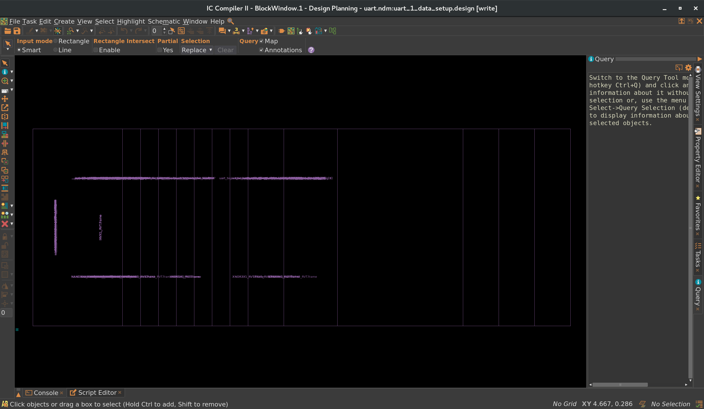

*ICC2 session with the design loaded from the synthesized netlist.*

## Step 2 — Floorplanning

Defines the physical canvas: the ~20 %-utilization core, the M1 rail wire-track pattern (`coord 0.037`, `space 0.074`), a `flip_first_row` row layout, auto-placed IO pins, PG/tie-net typing, and a congestion-aware initial placement.

- **Key scripts** — `scripts/floorplan.tcl` (`initialize_floorplan`, `place_pins`, `create_placement -floorplan -timing_driven`), `scripts/variables.tcl` (`CORE_UTILIZATION 0.2`, `CORE_OFFSET {13.5 13.5 13.5 13.5}`).
- **Reports** — `reports/utilization.rpt` (**20.3 %** of the 3,677.97 µ² core), `reports/congestion.rpt` (0 overflow), `reports/floorplan_legality.rpt`.
- **Handoff** → Step 3, which builds the power grid over this core.

*Initial floorplan: core rows, boundary IO ports, and first-cell placement.*

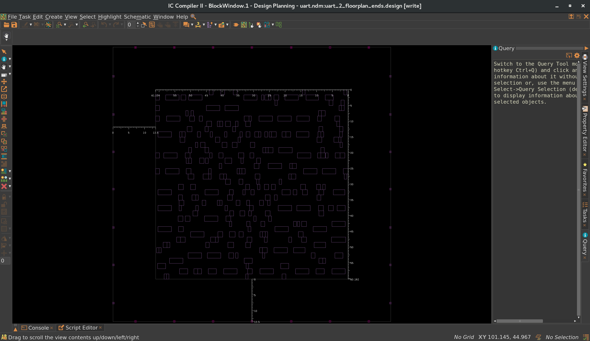

*Close-up of the standard-cell rows and M1 rail/track grid.*

## Step 3 — Power Planning

Builds the power-delivery network bottom-up and verifies it: **M1 rails** under the rows, a three-stage **mesh** (M5 horizontal straps, M6 vertical straps, M7 horizontal straps), and the peripheral **power ring** (M7/M6, width 1, spacing 3).

- **Key scripts** — `scripts/powerplanning.tcl` (`compile_pg -ignore_drc`, `check_pg_connectivity`, `check_pg_drc`).
- **Reports** — `reports/pg_connectivity.rpt` (VDD: 59 wires / 1,552 vias / 72 terminals, VSS: 59 / 1,608 / 74, **0 floating**), `reports/pg_drc.rpt` (no errors), `reports/pg_missing_vias.rpt` (0).
- **Handoff** → Step 4, placing cells under this grid.

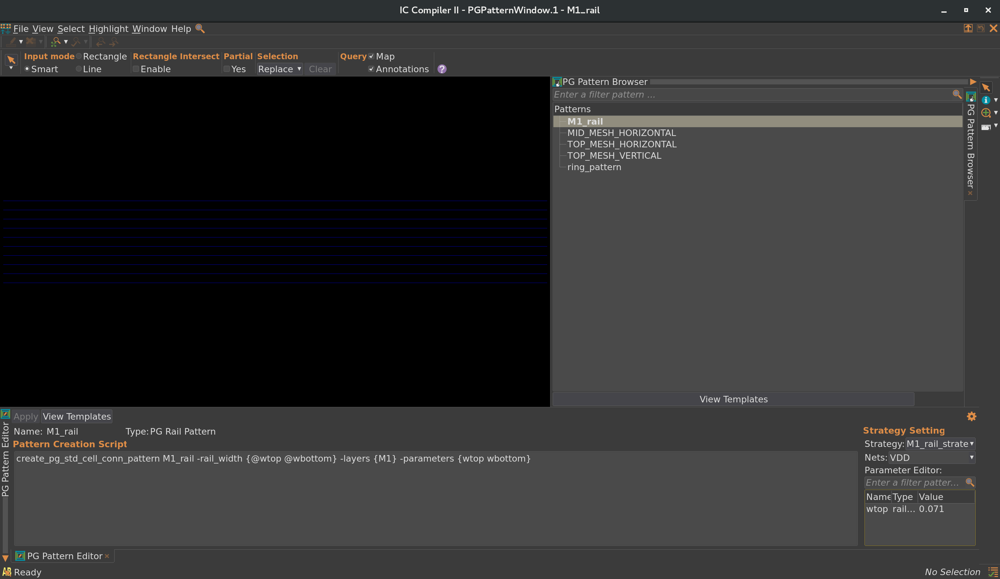

*M1 rails under the standard-cell rows.*

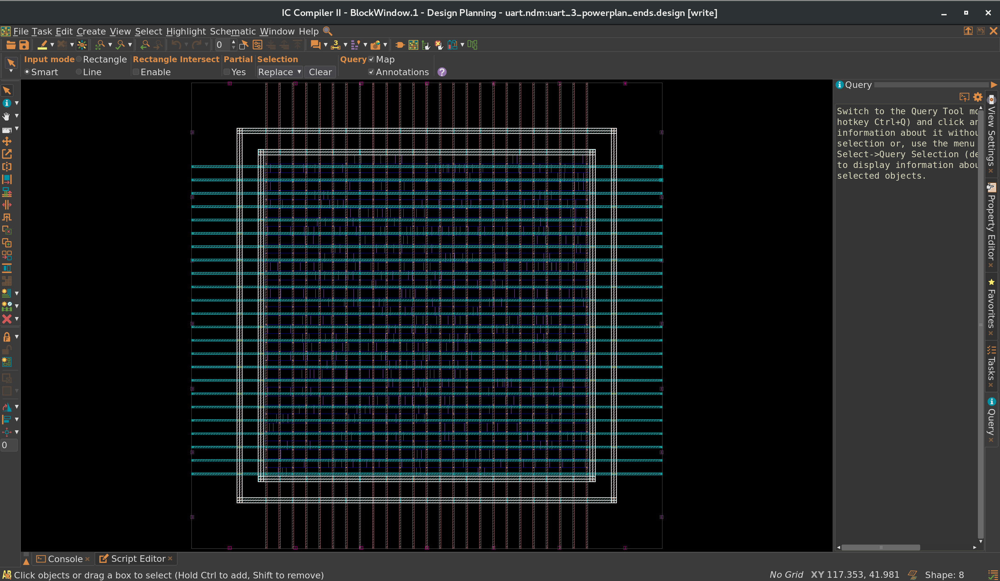

*VDD/VSS power ring around the core.*

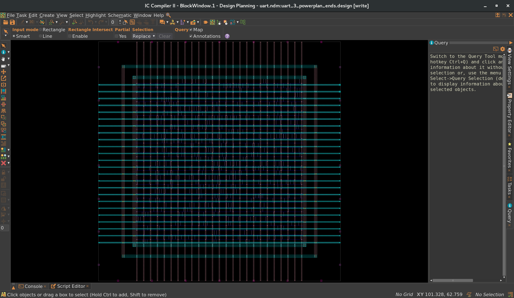

*Composited power grid: ring + M5/M6/M7 mesh + M1 rails.*

## Step 4 — Placement

`place_opt` runs concurrent timing–power-area optimization on the MCMM setup (slow/fast corners, `func_slow`/`func_fast` scenarios), then the design is legalized. No clock tree exists yet.

- **Key scripts** — `scripts/placement.tcl` (`place_opt` with instance prefix `place`, `legalize_placement`, `check_legality`), `common/mcmm.tcl`.
- **Reports** — `reports/timing/placement.max.tim` (**setup +5.25 ns**, slow corner), `reports/timing/placement.min.tim` (1 × −0.06 ns hold path — closed in later stages), `reports/place_legality.rpt` (0 violations).
- **Handoff** → Step 5, which builds the clock tree; hold fixing is completed by CTS + `route_opt`.

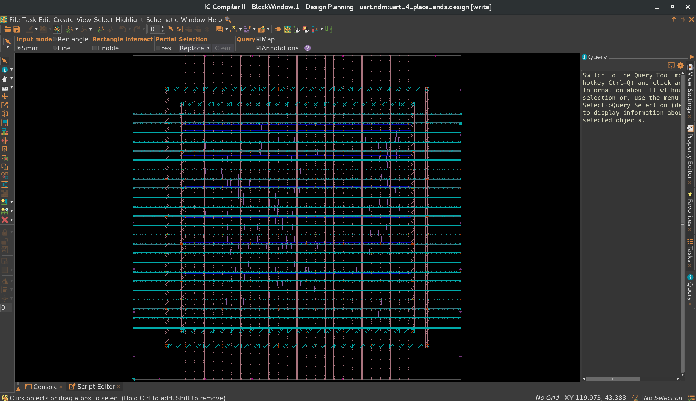

*The design after placement under the PG mesh.*

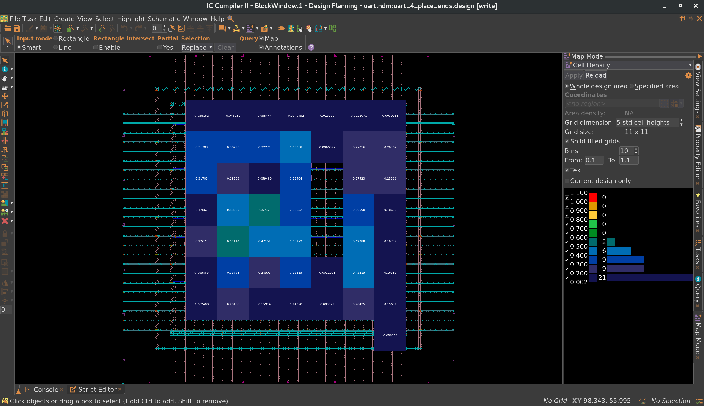

*Cell-density heat map (placement) — no congested regions.*

## Step 5 — Clock Tree Synthesis

Builds, routes, and optimizes the `sys_clk` tree (31 sinks) and completes hold fixing. The tree is confined to the M2–M4 budget with a `CLK_SPACING` rule (per-layer spacing 0.3 / 0.5 / 0.7 µm), built with the CTS reference buffer/inverter set and a 0.10 ns skew target. A post-CTS SDC is exported for downstream stages.

- **Key scripts** — `scripts/cts.tcl` (`clock_opt -from build_clock` and `-from route_clock -to final_opto`, `set_clock_routing_rules`), `scripts/variables.tcl` (`TARGET_SKEW 0.1`, `CLK_RULE_SPACINGS`).
- **Reports** — `reports/clock_tree.rpt` (**31 sinks, 1 level, global skew 0.00 ns, 0 trans/cap DRC both corners**), `reports/timing/clock.max.tim` (**setup +5.22 ns**), `reports/timing/clock.min.tim` (**hold +0.00 ns**).
- **Outputs** — `outputs/design.sdc` (post-CTS SDC).
- **Handoff** → Step 6, which routes the remaining signals.

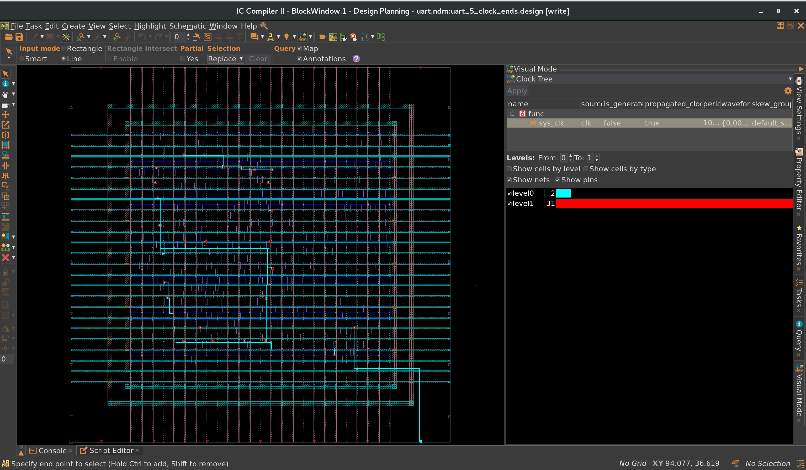

*The routed clock tree over the placed design.*

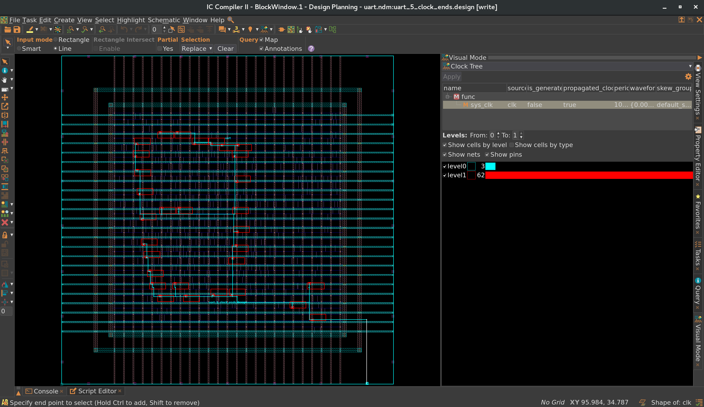

*Close-up of the clock tree branches and CTS buffer cells.*

## Step 6 — Routing

`route_auto` then `route_opt` route all signal nets; `optimize_routes` (up to 5 detail-route iterations) cleans DRCs. Full verification runs before the stage checkpoint: DRC, global-route congestion, in-design LVS, and legality.

- **Key scripts** — `scripts/routing.tcl` (`route_auto`, `route_opt`, `optimize_routes`, `check_route`, `verify_lvs`).
- **Reports** — `reports/op_check_route.rpt` (**0 DRC violations, 0 open nets**), `reports/route.congestion.rpt` (2 GRCs / 0.04 % overflow), `reports/route_lvs.rpt` (**0 short / 0 open / 0 floating**, 336 nets), `reports/op_legality.rpt`, `reports/timing/route.{max,min}.tim` (`+5.22 ns` / `+0.00 ns`).
- **Outputs** — `outputs/uart_pt.v` (post-route netlist for signoff STA in PrimeTime).
- **Handoff** → Step 7, the physical finishing stage.

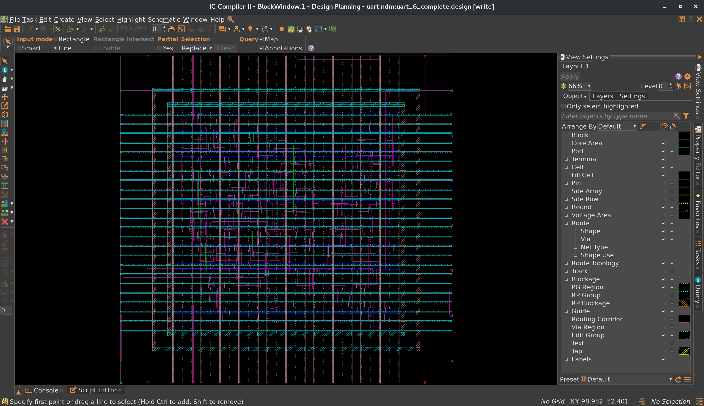

*The fully routed UART.*

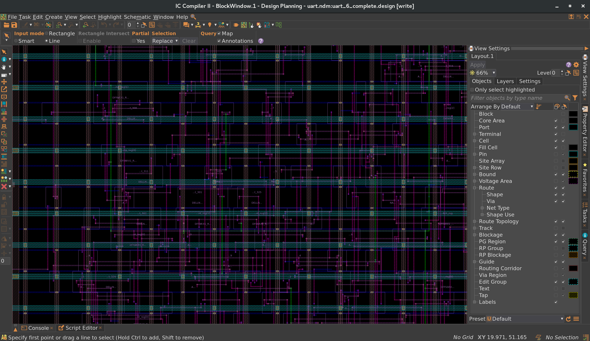

*Routing detail with clock and signal tracks on M2–M5.*

## Step 7 — Finishing

Physical finishing and stream-out: `add_redundant_vias`, `create_stdcell_fillers` (10,905 `SHFILL1_RVT` fillers fill every row site), final PG connection, in-design LVS (0 shorts / 0 opens), and write of every handoff artifact including the GDSII stream (merged std-cell GDS, PDK layer map, fill shapes).

- **Key scripts** — `scripts/finishing.tcl` (`add_redundant_vias`, `create_stdcell_fillers`, `setup_pg_nets`, `write_verilog` ×2, `write_sdc`, `write_parasitics`, `write_def`, `write_gds`, `save_block`).
- **Reports** — `reports/uart_PR_summary.rpt` (299 std cells + 10,905 fillers; core 3,677.97 µ², chip 7,681.96 µ²; **overall double-via 99.62 %; total DRC violations 0**), `reports/uart.final_legality.rpt` (0 violations), `reports/uart.lvs.rpt` (0 shorts / 0 opens), `reports/timing/final.{max,min}.tim` (`+5.22 ns` / `+0.00 ns`), `reports/uart.final_power.rpt` (**70.1 µW** total = 24.1 µW dynamic + 46.0 µW leakage). SI/crosstalk analysis is not enabled (`reports/crosstalk_delta.tim`).
- **Outputs** — `outputs/uart.v`, `outputs/uart.pg.v`, `outputs/uart.out.sdc`, `outputs/uart.out.spef` (+ per-corner files), `outputs/uart.out.def`, `outputs/uart.gds`.

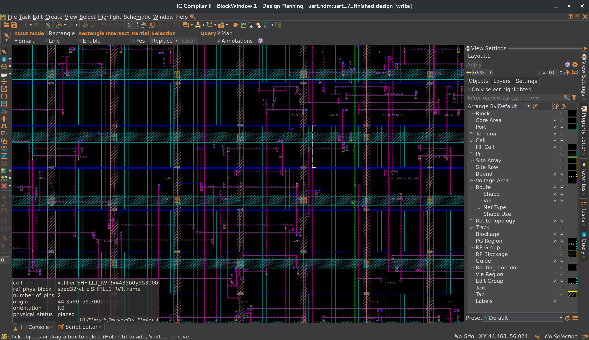

*Detail of the finished layout: routed core, fillers, and PG mesh.*

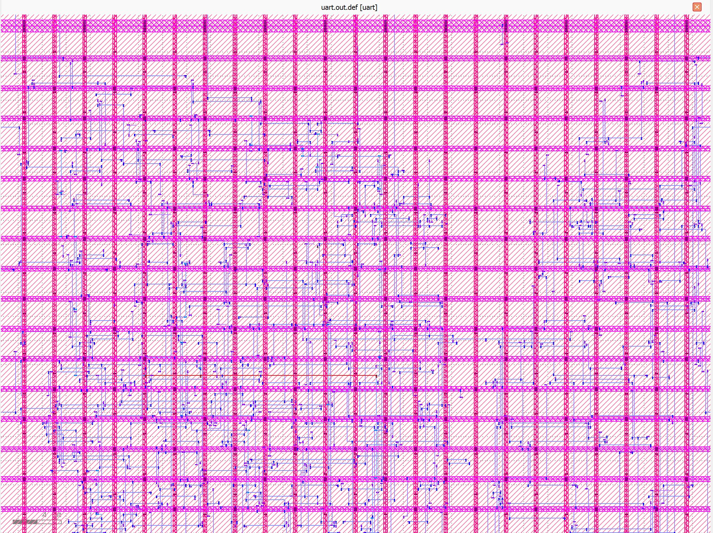

*Final core and IO ring as exported in the DEF.*

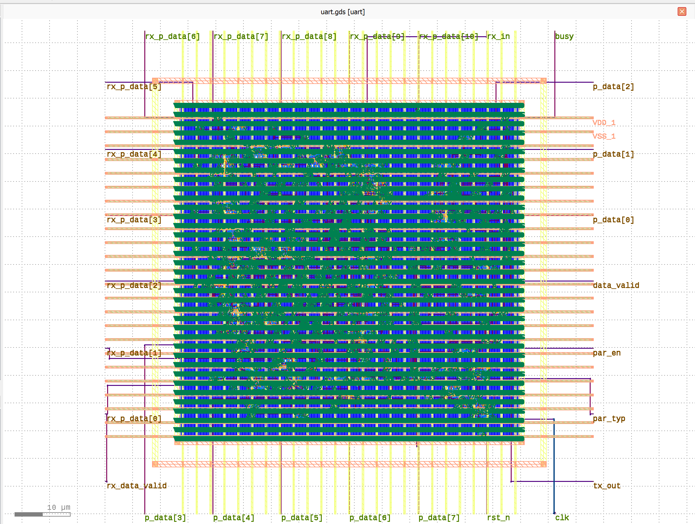

*GDSII stream-out view of the finished design.*

## Final PnR Outputs

| Artifact | File | Used by |
|----------|------|---------|
| Simulation netlist (no physical-only cells) | `step_7_finishing/outputs/uart.v` | Simulation |
| LVS/PT netlist (with PG nets) | `step_7_finishing/outputs/uart.pg.v` | LVS / signoff STA |
| Post-route signoff netlist | `step_6_routing/outputs/uart_pt.v` | PrimeTime |
| Final constraints | `step_7_finishing/outputs/uart.out.sdc` | Signoff STA, physical verif. |
| Parasitics (in-design SPEF; corners by StarRC) | `step_7_finishing/outputs/uart.out.spef*` | Signoff STA |
| Physical layout | `step_7_finishing/outputs/uart.out.def` | Tool import |
| Streamed layout (GDSII) | `step_7_finishing/outputs/uart.gds` | Tape-out / viewing |

Design-quality results: setup +5.22 ns / hold +0.00 ns (ICC2 in-design), 0 DRC / 0 legal violations, 0 shorts-opens (in-design LVS), 99.62 % double-via coverage, ~70.1 µW total power at the slow corner. These are **in-design checks** — the repository does not include a third-party signoff run. A one-page summary of these results lives in the [root README](../README.md).