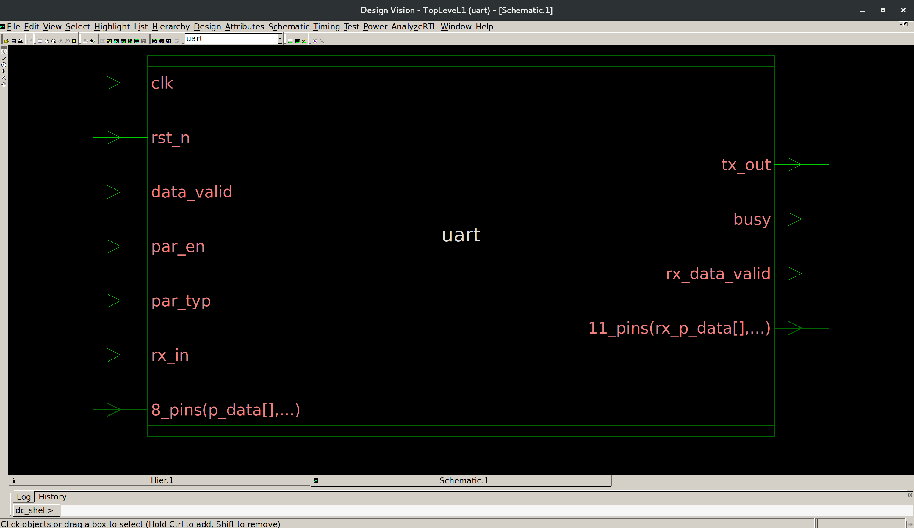
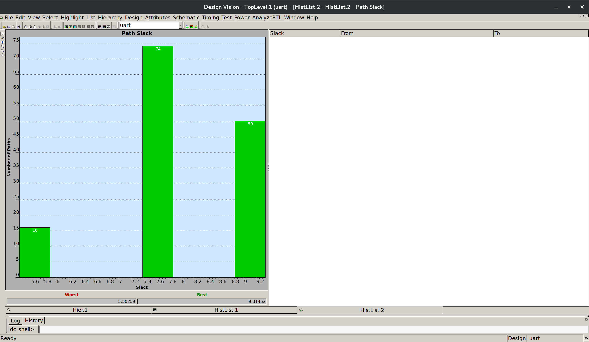
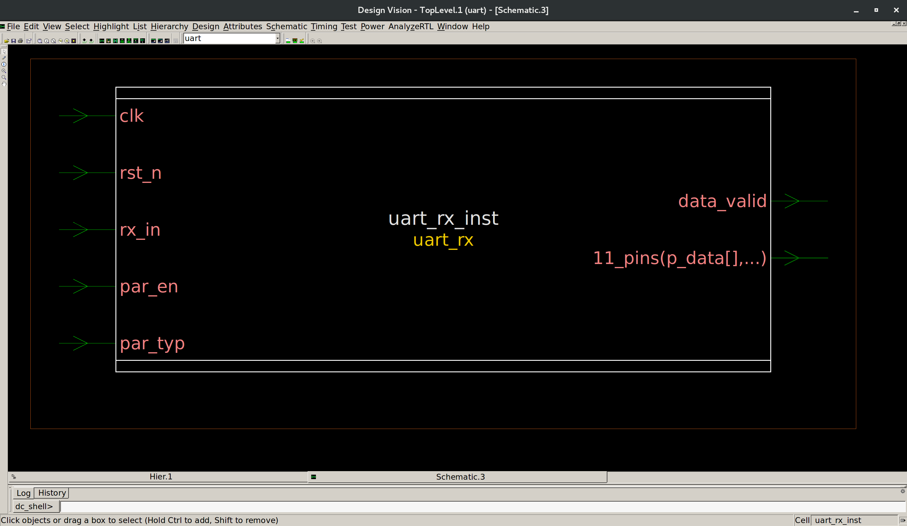
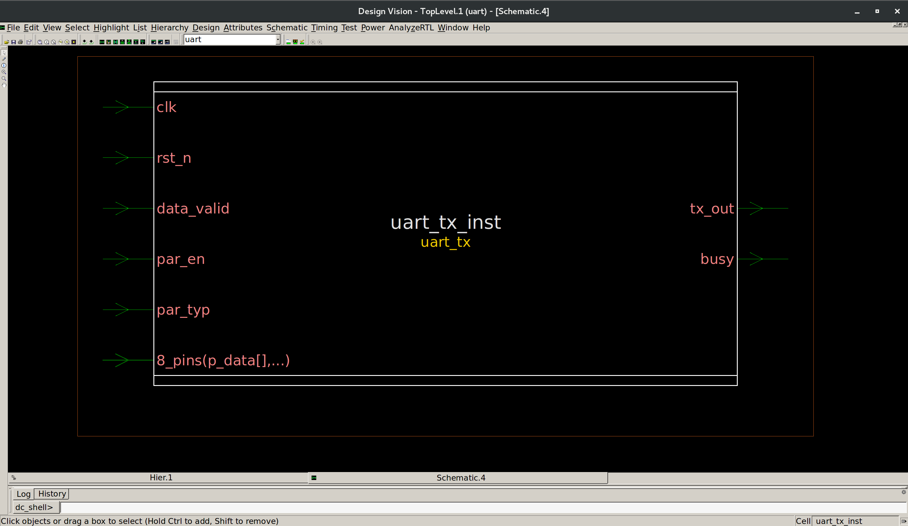

# Synthesis

This directory contains the **Synopsys Design Compiler synthesis stage** for the UART. Synthesis is the step that transforms the RTL design into a gate-level implementation — a netlist of standard cells and macros that is suitable for the downstream ASIC physical-design flow.

## Role in the ASIC Flow

Synthesis sits at the front of the ASIC implementation chain. It consumes:

- **RTL** — from `../rtl/` (`rtl_rx/`, `rtl_tx/`, and the top-level `uart.v`)
- **Constraints** — from `../cons/master.tcl`, expressing the design's timing requirements
- **Technology / library setup** — the standard-cell, SRAM, I/O and PLL libraries and corners selected in `../common/`

Design Compiler reads the RTL, applies the constraints and library setup, and maps the design to the target library. The result is a gate-level netlist that feeds both the **PnR** flow (ICC2) and **formal verification** (Formality). In particular, the synthesis run:

- generates the gate-level netlist used as the reference for physical design.
- exports a post-synthesis SDC that ICC2 consumes for its MCMM timing setup.
- records the synthesis guidance in an SVF file used for RTL-to-netlist equivalence checking.

## Contents

- `run_syn.tcl` — The entry point: launches `dc_shell` on the master script and tees the transcript to `logs/syn.log`.

- `scripts/` — The synthesis flow, driven by `master.tcl`, which sources the modules in order:
  - `libraries_setup.tcl` — search path, target/link libraries, and synthesis-specific settings (e.g. RTL power/ground ports, netlist-shaping switches).
  - `read_design.tcl` — reads/analyzes the RTL (list-based or analyze/elaborate), elaborates the top module, links, and sanity-checks the design.
  - `constraints_setup.tcl` — sources the constraints and sets up timing path groups.
  - `compile_strategies.tcl` — runs the compile, selectable between **timing**, **area**, or **power** optimization strategy via `COMPILE_STRATEGY`.
  - `reports.tcl` — writes the QoR and extended reports.
  - `save_outputs.tcl` — writes all synthesis outputs.

## Inputs and Outputs

| Item | Location |
|------|----------|
| RTL input | `../rtl/` |
| Constraints input | `../cons/master.tcl` |
| Netlist output | `output/uart_netlist.v` |
| DDC (binary design) | `output/uart.ddc` |
| Post-synthesis SDC | `output/uart_output.sdc` |
| SDF (simulation back-annot.) | `output/uart.sdf` |
| SVF (for Formality) | `output/uart_fm.svf` |

## Reports / Results

The compile also generates a set of standard Design Compiler reports. Core QoR reports (timing setup/hold, overall QoR with WNS/TNS and area, and hierarchical area and power breakdowns) are written under `reports/qor/`. Extended reports (clocks, constraints, cell/reference usage, ports, hierarchy, design summary, timing requirements, case analysis) are stored directly under `reports/`.

So a reader visiting this folder would expect to find, after a synthesis run:

- the synthesized **gate-level netlist** (`output/`)
- **timing / QoR information** — setup and hold slacks, WNS/TNS, area, cell counts (`reports/`)
- **area and power information** — hierarchical area and power reports (`reports/qor/`)
- **constraint / clock details** — constraint and clock reports (`reports/`)
- **logs** of the run (`logs/syn.log`)

## Results (this run)

From `reports/qor/uart_qor.rpt` and `reports/qor/uart_area.rpt` — DC **O-2018.06-SP1**, target library `saed32rvt_tt1p05v25c`:

| Metric | Value |
|--------|-------|
| Design | 263 leaf cells / 13 hierarchies / 40 sequential / 223 combinational |
| Timing QoR | Setup **WNS 0.00**, 0 violating paths (`sys_clk` slack 9.23 ns, COMBO 5.50 ns, INPUT 7.58 ns, OUTPUT 7.54 ns) |
| Hold QoR | 1 × 0.02 ns hold path (fixed later in physical design — final hold slack +0.00 ns) |
| Design rules | 0 max-transition / 0 max-capacitance violations |
| Cell area | 747.18 (comb. 463.56 + noncomb. 283.62 + buf/inv 85.90) |
| Design area | 833.01 |
| Area split | RX ≈ 70.2 %, TX ≈ 25.1 % of core |

## Visuals

*Gate-level uart netlist as displayed in Design Vision after compile.*

*Timing/QoR summary of the synthesized design.*

*Synthesized uart_rx sub-design.*

*Synthesized uart_tx sub-design.*
