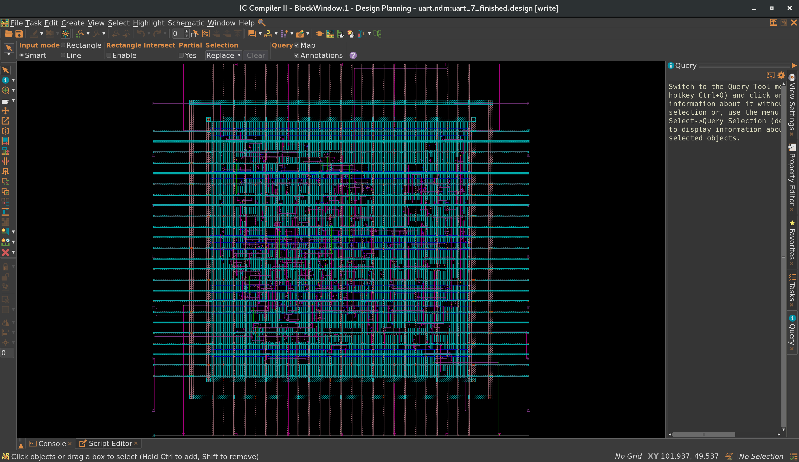
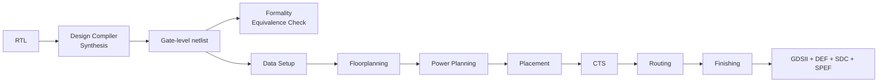

# UART
 
An 8-bit UART design carried from RTL through a complete Synopsys RTL-to-GDSII ASIC implementation, alongside independent, FPGA-verified RX and TX blocks.
 
<p align="center">
  
</p>
<p align="center"><em>Final routed layout  (<a href="./ASIC_FLOW/pnr/step_7_finishing/">step_7_finishing</a>)</em></p>
 
## Overview
 
This repository contains two related but distinct efforts:
 
- **[`UART_RX`](UART_RX/README.md) / [`UART_TX`](UART_TX/README.md)** — standalone, parameterizable UART receiver and transmitter blocks in Verilog, each with its own SystemVerilog testbench and FPGA implementation (Basys3 board).
- **[`ASIC_FLOW`](ASIC_FLOW/README.md)** — a self-contained ASIC backend flow that takes the combined RX + TX RTL through Design Compiler synthesis, Formality equivalence checking, and a full IC Compiler II physical implementation down to a streamed GDSII.
The RTL used inside `ASIC_FLOW` was gathered from `UART_RX`/`UART_TX` into its own `ASIC_FLOW/rtl/` directory to keep the ASIC flow self-contained; the RX/TX blocks each retain their own separate simulation and FPGA flows.
 
## Repository Contents
 
| Directory | Description |
|-----------|--------------|
| [`UART_RX/`](UART_RX/README.md) | 8-bit UART receiver: 6-state FSM, 8x oversampling with majority voting, glitch rejection, configurable parity, directed SV testbench, Basys3 FPGA implementation. |
| [`UART_TX/`](UART_TX/README.md) | 8-bit UART transmitter: 5-state FSM, LSB-first serialization, configurable parity, directed SV testbench, Basys3 FPGA implementation. |
| [`ASIC_FLOW/`](ASIC_FLOW/README.md) | Complete RTL-to-GDSII flow for the combined UART design on a SAED32 (32 nm, 9-metal) process — synthesis, formal verification, and seven-stage IC Compiler II physical implementation. |
 
## ASIC Flow
 
`ASIC_FLOW` drives the combined UART RTL through a logic stage and a physical stage:
 

 
**Logic stage** — [`cons/`](ASIC_FLOW/cons/README.md) defines timing/design intent, [`syn/`](ASIC_FLOW/syn/README.md) synthesizes the RTL to a gate-level netlist on the SAED32 RVT library, and [`fm/`](ASIC_FLOW/fm/README.md) formally verifies the netlist against the RTL.
 
**Physical stage** — [`pnr/`](ASIC_FLOW/pnr/README.md) is a seven-stage ICC2 flow (Data Setup → Floorplanning → Power Planning → Placement → CTS → Routing → Finishing), where each stage re-opens the previous checkpoint and saves a new named checkpoint into the NDM design library. Full per-stage scripts, reports, and screenshots are documented there.
 
> DRC/LVS results above are **in-design checks run inside ICC2** (0 violations); the repository does not include a third-party foundry signoff verification run.
 
## Tools & Technologies
 
- **Synopsys Design Compiler** — RTL synthesis
- **Synopsys Formality** — RTL-vs-netlist equivalence checking
- **Synopsys IC Compiler II (ICC2)** — physical implementation (floorplanning, power planning, placement, CTS, routing, finishing, GDSII stream-out)
- **Process** — SAED32, 32 nm, 1P9M, RVT standard-cell library
- **Xilinx Vivado** — FPGA synthesis/implementation for `UART_RX`/`UART_TX` on the Artix-7 (Basys3)
- **SystemVerilog** — directed testbenches for RX and TX
## Results
 
Selected implementation results from `ASIC_FLOW`, based on in-design ICC2 physical verification — not a third-party foundry signoff run (full detail and sources in [`ASIC_FLOW/README.md`](ASIC_FLOW/README.md)):
 
| Metric | Result |
|--------|--------|
| Synthesis | 263 leaf cells / 40 FFs, setup WNS 0.00 ns (met) |
| Formality | 54/54 compare points passing |
| Final timing (ICC2, in-design) | Setup +5.22 ns, hold +0.00 ns (met) |
| Final cell count | 299 std cells + 10,905 fillers |
| Core / chip area | 3,677.97 / 7,681.96 µm² |
| DRC / LVS (ICC2 in-design checks) | 0 violations / 0 shorts, 0 opens |
| Power (slow corner, 125 °C) | ~70.1 µW (24.1 µW dynamic + 46.0 µW leakage) |
 
For RTL-level and FPGA-level results (resource utilization, FPGA timing, test-case coverage), see the [`UART_RX`](UART_RX/README.md) and [`UART_TX`](UART_TX/README.md) READMEs.
 
## Repository Structure
 
```text
UART/
├── UART_RX/           # Standalone UART receiver — RTL, sim, FPGA flow
├── UART_TX/            # Standalone UART transmitter — RTL, sim, FPGA flow
├── ASIC_FLOW/           # RTL-to-GDSII ASIC implementation
│   ├── common/          # Shared setup: variables, libraries, MCMM config
│   ├── rtl/              # Combined UART RTL used by the ASIC flow
│   ├── cons/              # Design constraints (SDC intent)
│   ├── syn/                # Design Compiler synthesis
│   ├── fm/                  # Formality equivalence checking
│   └── pnr/                  # IC Compiler II — seven-stage physical implementation
└── README.md
```
 
## Documentation
 
- [`ASIC_FLOW/README.md`](ASIC_FLOW/README.md) — full ASIC flow overview and signoff summary
- [`ASIC_FLOW/pnr/README.md`](ASIC_FLOW/pnr/README.md) — detailed per-stage PnR documentation
- [`ASIC_FLOW/rtl/README.md`](ASIC_FLOW/rtl/README.md) — RTL sourced for the ASIC flow
- [`UART_RX/README.md`](UART_RX/README.md) — UART receiver design, verification, and FPGA implementation
- [`UART_TX/README.md`](UART_TX/README.md) — UART transmitter design, verification, and FPGA implementation
 
