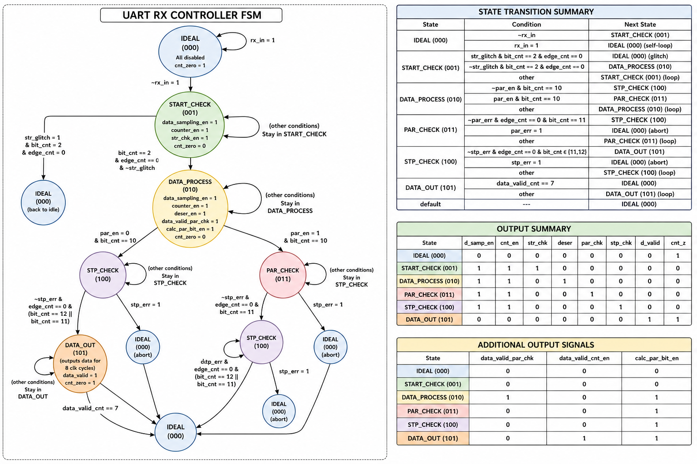
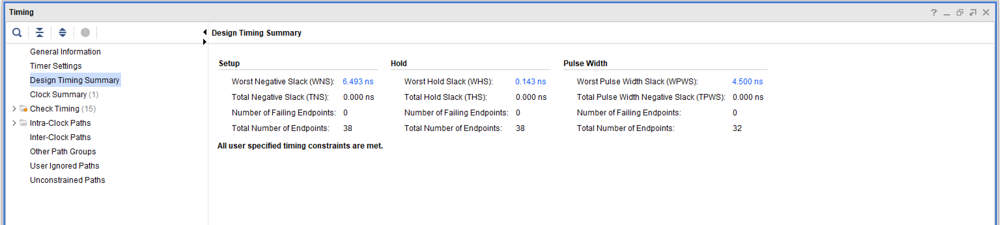
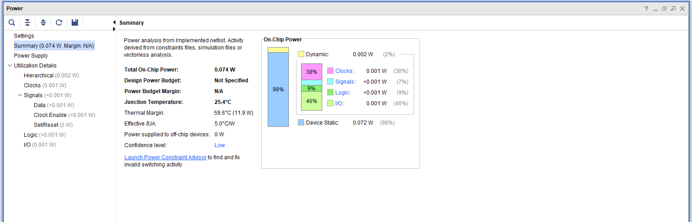
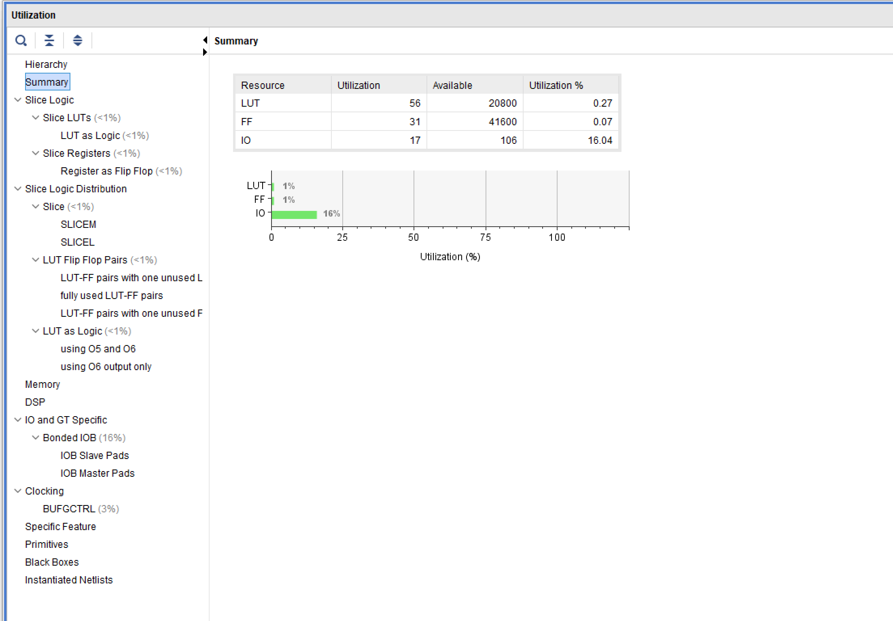
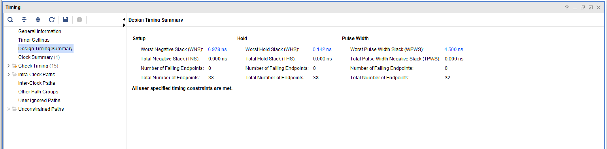
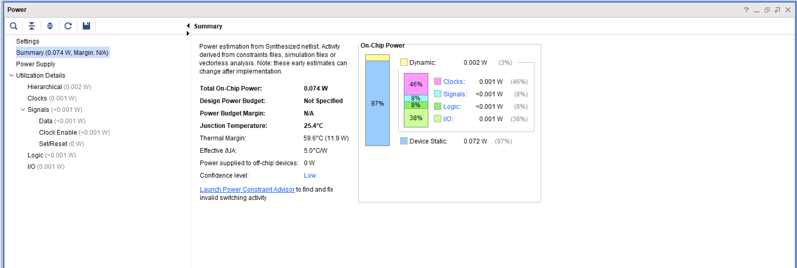
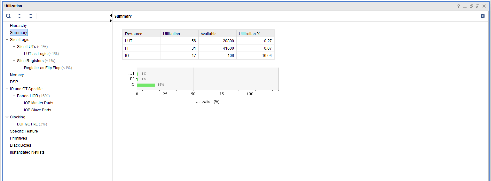

# UART Receiver (UART_RX)

A parameterizable 8-bit UART Receiver designed in Verilog HDL, featuring a 6-state FSM, 8x oversampling with triple-sample majority voting, start-bit glitch rejection, configurable even/odd parity with error detection, stop-bit framing checks, and full FPGA implementation targeting the Digilent Basys3 board.

---

## Project Highlights

- **Modular UART RX RTL architecture** -- Small, focused sub-modules (FSM controller, counters, data sampling, deserializer, parity, start/stop checks) that are easy to understand, verify, and extend.
- **8x oversampling with majority voting** -- Each bit period is sampled 8 times and the three center samples (edge counts 3, 4, 5) are resolved by a 2-of-3 majority vote for noise immunity.
- **Configurable parity support** -- Even/odd parity with enable/disable, plus start-bit glitch rejection and stop-bit framing checks with automatic frame rejection on error.
- **Directed SystemVerilog verification** -- 7 directed test cases covering glitch rejection, correct and corrupted parity frames, and no-parity reception.
- **FPGA implementation on Basys3** -- Synthesized, placed, and routed on the Xilinx Artix-7 (xc7a35tcpg236-1) at 100 MHz with all timing constraints met.

---

## Features

- 8-bit serial-to-parallel data reception
- 6-state FSM-based control architecture
- **8x oversampling** for bit timing recovery
- **Triple-sample majority voting** at edge counts 3, 4, and 5
- LSB-first bit ordering
- Start-bit verification with **glitch rejection**
- Stop-bit checking (**framing error** detection)
- Configurable parity: **even** (`PAR_TYP=0`) and **odd** (`PAR_TYP=1`)
- Parity enable/disable via `PAR_EN` input
- **Parity error** detection with automatic frame rejection
- 11-bit parallel frame output (`P_DATA[10:0]`) reconstructing start, data, parity, and stop bits (parity field forced to logic 1 when parity is disabled)
- `DATA_VALID` status output held for 8 clock cycles (full bit-period output-valid window)
- Asynchronous active-low reset
- Fully verified with 7 directed test cases
- Synthesized and implemented on Xilinx Artix-7 (xc7a35tcpg236-1)

---

## Project Overview

**UART** (Universal Asynchronous Receiver/Transmitter) is a widely used serial communication protocol for point-to-point data exchange. It operates without a shared clock line, relying on agreed-upon frame conventions between transmitter and receiver.

This project implements the **receiver half** of a UART link. It monitors the serial line and, while in the idle state, detects a low level on `RX_IN` as the start condition. It then verifies the start bit by oversampling and reconstructs the transmitted byte from an incoming UART frame consisting of:

1. A **start bit** (logic 0) that signals the beginning of a transfer
2. **8 data bits** received LSB first
3. An optional **parity bit** for single-bit error detection
4. A **stop bit** (logic 1) that signals the end of the transfer

Because the receiver does not share a clock with the transmitter, it cannot know exactly when each bit begins. The design therefore uses **8x oversampling**: the serial line is sampled eight times per bit period. Three samples taken at the middle of the bit (edge counts 3, 4, and 5) are resolved with **majority voting** to produce a noise-immune `SAMPLED_BIT`. Before any data is collected, the start bit is oversampled and verified; a high majority-sampled value is treated as a line glitch and the receiver returns to idle. Parity and stop bits are likewise checked, and any corrupted frame is discarded.

---

## UART Frame Format

### With Parity Enabled (`PAR_EN = 1`)

```
+--------+--------+--------+--------+--------+--------+--------+--------+--------+-----------+--------+
|  Start |  D[0]  |  D[1]  |  D[2]  |  D[3]  |  D[4]  |  D[5]  |  D[6]  |  D[7]  |  Parity   |  Stop  |
|  (1b)  |  (1b)  |  (1b)  |  (1b)  |  (1b)  |  (1b)  |  (1b)  |  (1b)  |  (1b)  |   (1b)    |  (1b)  |
|  Logic 0| LSB  ->  ->  ->  ->  ->  ->  ->  MSB|  Checked | Logic 1|
+--------+--------+--------+--------+--------+--------+--------+--------+--------+-----------+--------+
|<--------------------------- 11 Bits (88 Clock Cycles) ------------------------------------>|
```

### Without Parity (`PAR_EN = 0`)

```
+--------+--------+--------+--------+--------+--------+--------+--------+--------+--------+
|  Start |  D[0]  |  D[1]  |  D[2]  |  D[3]  |  D[4]  |  D[5]  |  D[6]  |  D[7]  |  Stop  |
|  (1b)  |  (1b)  |  (1b)  |  (1b)  |  (1b)  |  (1b)  |  (1b)  |  (1b)  |  (1b)  |  (1b)  |
|  Logic 0| LSB  ->  ->  ->  ->  ->  ->  ->  MSB|          Logic 1          |
+--------+--------+--------+--------+--------+--------+--------+--------+--------+--------+
|<----------------------------- 10 Bits (80 Clock Cycles) ---------------------------------->|
```

Each bit occupies **8 clock cycles** at the receiver (8x oversampling).

### Parity Bit Computation

| Mode | `PAR_TYP` | Receiver Calculation |
|------|-----------|----------------------|
| **Even** | `0` | XOR accumulator seeded with `0`, then XORed with each received data bit. The result makes the total number of 1-bits in data+parity even. |
| **Odd** | `1` | XOR accumulator seeded with `1`, then XORed with each received data bit. The result makes the total number of 1-bits in data+parity odd. |

---

## Project Architecture

### RTL Hierarchy

```
uart_rx (Top Level)
|
+-- uart_rx_controller          FSM + output decode
|   +-- State Memory            3-bit registered state
|   +-- Next-State Logic        Combinational transition logic
|   +-- Output Logic            Enable signals for all sub-modules
|
+-- uart_rx_counters            Edge, bit, and data-valid counters
|   +-- 3-bit edge counter      Counts 8 oversampling edges (0-7)
|   +-- 4-bit bit counter       Bit position within the frame
|   +-- 3-bit data-valid counter  Counts 8 output cycles in DATA_OUT
|
+-- uart_rx_data_sampling       Triple sampling + majority voting
|   +-- 3-bit sample register   Captures rx_in at edge counts 3, 4, 5
|   +-- Majority vote decoder   Resolves samples into sampled_bit
|
+-- uart_rx_deserializer        Frame assembly
|   +-- 8-bit data register     Accumulates sampled data bits (D0-D7)
|   +-- Output logic            Reconstructs P_DATA from frame fields
|
+-- uart_rx_parity_check        Parity calculator + comparator
|   +-- XOR accumulator         Computes parity on received data
|   +-- Error comparator        Compares calculated vs received parity
|
+-- uart_rx_start_check         Start bit verifier
|   +-- Glitch detector         Flags a high majority-sampled start bit
|
+-- uart_rx_stop_check          Stop bit verifier
    +-- Framing detector        Flags a low majority-sampled stop bit
```

## Data Flow

A complete reception proceeds as follows:

**1. Idle State** -- The controller sits in `IDLE`. All sub-modules are disabled and the counters are held at zero (`CNT_ZERO = 1`). The receiver monitors `RX_IN` for a low level, which indicates a start condition.

**2. Start Bit Detection** -- When the controller observes `RX_IN` low while in `IDLE`, it moves to `START_CHECK`. Sampling and counting are enabled for a full bit window (8 oversampling edges). The start candidate is sampled at edge counts 3, 4, and 5 and resolved by majority voting.

**3. Start Bit Verification** -- If the majority-sampled value is high, the low pulse is classified as a **glitch**: `STR_GLITCH` is asserted and the controller returns to `IDLE`. If the majority-sampled value is low, the start bit is genuine and the controller advances to `DATA_PROCESS`.

**4. Data Reception** -- The controller samples the 8 data bits, LSB first. Each bit's majority vote is stored by the deserializer into `P_DATA_TEMP`, and the parity accumulator XORs each received data bit to compute the expected parity.

**5. Parity Check (optional)** -- If `PAR_EN = 1`, the controller moves to `PAR_CHECK`. The calculated parity is compared with the received parity bit. A mismatch asserts `PAR_ERR` and the controller discards the frame by returning to `IDLE`. A match advances to `STP_CHECK`.

**6. Stop Bit Check** -- The controller moves to `STP_CHECK` and samples the stop bit. A majority-sampled stop bit that is not logic 1 asserts `STP_ERR` (framing error) and the frame is discarded by returning to `IDLE`. A valid stop bit advances to `DATA_OUT`.

**7. Data Output** -- The controller enters `DATA_OUT`. `DATA_VALID` is asserted and `P_DATA` carries the reconstructed frame for 8 clock cycles, after which the controller returns to `IDLE` and the receiver is ready for the next transfer.

---

## Finite State Machine

The controller implements a **6-state Moore FSM** with registered state and combinational next-state and output logic.

### States

| State | Encoding | Description |
|-------|----------|-------------|
| `IDLE` | `3'b000` | Waiting for the start condition (`RX_IN` low while `IDLE`). Counters zeroed. |
| `START_CHECK` | `3'b001` | Oversampling and verifying the start bit. `STR_GLITCH` rejection. |
| `DATA_PROCESS` | `3'b010` | Sampling the 8 data bits and accumulating the parity. |
| `PAR_CHECK` | `3'b011` | Comparing calculated vs received parity bit (if `PAR_EN=1`). |
| `STP_CHECK` | `3'b100` | Sampling and verifying the stop bit. `STP_ERR` rejection. |
| `DATA_OUT` | `3'b101` | Driving `P_DATA` and `DATA_VALID` for 8 clock cycles. |

### FSM State Diagram



### Output Encoding

| State | `SAMPLING_EN` | `COUNTER_EN` | `CNT_ZERO` | `STR_CHK_EN` | `DESER_EN` | `PAR_CHK_EN` | `STP_CHK_EN` | `DATA_VALID` |
|-------|---------------|--------------|------------|--------------|------------|--------------|--------------|--------------|
| `IDLE` | 0 | 0 | 1 | 0 | 0 | 0 | 0 | 0 |
| `START_CHECK` | 1 | 1 | 0 | 1 | 0 | 0 | 0 | 0 |
| `DATA_PROCESS` | 1 | 1 | 0 | 0 | 1 | 0 | 0 | 0 |
| `PAR_CHECK` | 1 | 1 | 0 | 0 | 0 | 1 | 0 | 0 |
| `STP_CHECK` | 1 | 1 | 0 | 0 | 0 | 0 | 1 | 0 |
| `DATA_OUT` | 0 | 0 | 1 | 0 | 0 | 0 | 0 | 1 |

---

## Module Descriptions

| Module | File | Description | Key Inputs | Key Outputs |
|--------|------|-------------|------------|-------------|
| `uart_rx` | `rtl/uart_rx_top.v` | Top-level module. Instantiates and interconnects all sub-modules. | `clk`, `rst_n`, `rx_in`, `par_en`, `par_typ` | `p_data[10:0]`, `data_valid` |
| `uart_rx_controller` | `rtl/uart_rx_controller.v` | 6-state FSM controller. Manages state transitions and all sub-module enable signals. | `clk`, `rst_n`, `rx_in`, `bit_cnt[3:0]`, `edge_cnt[2:0]`, `data_valid_cnt[2:0]`, `str_glitch`, `stp_err`, `par_err`, `par_en` | `data_sampling_en`, `counter_en`, `cnt_zero`, `par_chk_en`, `stp_chk_en`, `str_chk_en`, `deser_en`, `data_valid`, `data_valid_par_chk`, `data_valid_cnt_en`, `calc_par_bit_en` |
| `uart_rx_counters` | `rtl/uart_rx_counters.v` | Generates the oversampling edge count, the frame bit count, and the data-valid output count. | `clk`, `rst_n`, `enable`, `data_valid_cnt_en`, `cnt_zero` | `bit_cnt[3:0]`, `edge_cnt[2:0]`, `data_valid_cnt[2:0]` |
| `uart_rx_data_sampling` | `rtl/uart_rx_data_sampling.v` | Samples `rx_in` three times per bit and applies majority voting to produce `sampled_bit`. | `clk`, `rst_n`, `rx_in`, `data_samp_en`, `edge_cnt[2:0]`, `bit_cnt[3:0]` | `sampled_bit` |
| `uart_rx_deserializer` | `rtl/uart_rx_deserializer.v` | Assembles the frame. Stores data bits and reconstructs `P_DATA`. | `clk`, `rst_n`, `deser_en`, `sampled_bit`, `bit_cnt[3:0]`, `edge_cnt[2:0]`, `data_valid`, `calc_par_bit`, `par_en` | `p_data[10:0]` |
| `uart_rx_parity_check` | `rtl/uart_rx_parity_check.v` | Computes even/odd parity on the received data and compares it with the received parity bit. | `clk`, `rst_n`, `par_typ`, `par_chk_en`, `sampled_bit`, `calc_par_bit_en`, `data_valid_par_chk`, `edge_cnt[2:0]` | `par_err`, `calc_par_bit` |
| `uart_rx_start_check` | `rtl/uart_rx_start_check.v` | Verifies the start bit is logic 0. Flags a glitch when the sampled bit is high. | `clk`, `rst_n`, `sampled_bit`, `str_chk_en` | `str_glitch` |
| `uart_rx_stop_check` | `rtl/uart_rx_stop_check.v` | Verifies the stop bit is logic 1. Flags a framing error when the sampled bit is low. | `clk`, `rst_n`, `sampled_bit`, `stp_chk_en` | `stp_err` |

---

## Timing

| Parameter | Value |
|-----------|-------|
| System Clock Constraint | 10 ns period (100 MHz), per `uart_rx_top_Basys_3.xdc` |
| Oversampling Factor | 8x (8 clock cycles per bit) |
| Sampling Points | Edge counts 3, 4, and 5 of each bit window |
| Majority Voting | 2-of-3 on the three middle samples |
| Bit Duration | 8 clock cycles |
| Frame Duration (no parity) | 10 bits = 80 clock cycles |
| Frame Duration (with parity) | 11 bits = 88 clock cycles |
| `DATA_VALID` Duration | 8 clock cycles |

The receiver oversamples the serial line **eight times per bit**. The internal edge counter operates over counts **0 to 7**, and the three samples used for majority voting are captured at edge counts **3, 4, and 5** -- the three center samples of the bit window. This is the standard approach for asynchronous receivers: sampling near the center of each bit period avoids the transitions at the bit edges and tolerates minor clock mismatch between the transmitter and receiver.

---

## Interface

| Port | Direction | Width | Description |
|------|-----------|-------|-------------|
| `clk` | Input | 1 | System clock (100 MHz oscillator on Basys3) |
| `rst_n` | Input | 1 | Asynchronous active-low reset |
| `rx_in` | Input | 1 | Serial receive input |
| `par_en` | Input | 1 | Parity enable: `1` = include parity bit |
| `par_typ` | Input | 1 | Parity type: `0` = even, `1` = odd |
| `p_data` | Output | 11 | Reconstructed frame: `{start, data[7:0], parity/unused, stop}`. When `PAR_EN = 0` the parity field is unused. |
| `data_valid` | Output | 1 | High for 8 clock cycles when `p_data` is valid |

### `P_DATA` Output Layout

`P_DATA` is always 11 bits wide. The frame is reconstructed as `{start bit, 8 data bits, parity/unused field, stop bit}`.

- When `PAR_EN = 1`, `p_data[1]` holds the received **parity bit**, which is checked against the internally calculated parity.
- When `PAR_EN = 0`, the parity field is **not used**: the receiver performs no parity check. The reserved parity position is forced to logic `1`, maintaining a valid UART idle/stop-level representation in the reconstructed frame.
- The receiver uses `PAR_EN` to determine whether `p_data[1]` represents a parity bit or an unused field.

| Bit | `PAR_EN = 1` | `PAR_EN = 0` |
|-----|--------------|--------------|
| `p_data[10]` | Start bit (0) | Start bit (0) |
| `p_data[9:2]` | Data bits (D7:D0) | Data bits (D7:D0) |
| `p_data[1]` | Parity bit (checked) | Reserved parity field = 1 (unused when `PAR_EN = 0`) |
| `p_data[0]` | Stop bit (1) | Stop bit = 1 |

---

## Simulation

### Simulator

The design was simulated using **Mentor Graphics ModelSim** (Intel FPGA Edition). The simulation script (`sim/run.tcl`) compiles all RTL sources and the SystemVerilog testbench, then runs the full simulation to completion.

### How to Run Simulation

```tcl
# From the sim/ directory in ModelSim:
do run.tcl
```

Or manually in the ModelSim console:

```tcl
quit -sim
vlib work
vlog "../rtl/uart_rx_counters.v"
vlog "../rtl/uart_rx_data_sampling.v"
vlog "../rtl/uart_rx_deserializer.v"
vlog "../rtl/uart_rx_parity_check.v"
vlog "../rtl/uart_rx_start_check.v"
vlog "../rtl/uart_rx_stop_check.v"
vlog "../rtl/uart_rx_controller.v"
vlog "../rtl/uart_rx_top.v"
vlog -sv "./uart_rx_tb.sv"
vsim -voptargs=+acc uart_rx_tb
run -all
```

### Testbench Strategy

The testbench (`sim/uart_rx_tb.sv`) applies **7 directed test cases** covering start-bit glitch rejection, correct and corrupted parity frames, and no-parity reception. Each frame bit is driven for exactly 8 clock cycles to match the 8x oversampling.

| Test Case | `PAR_EN` | `PAR_TYP` | Frame | Description |
|-----------|----------|-----------|-------|-------------|
| 1 | 1 | 0 | Glitch only | Start glitch rejection. `RX_IN` low for 1 cycle then high. No frame. |
| 2 | 1 | 0 | `0` / `0x6B` / `1` / `1` | Correct frame with even parity. 5 ones in data -> parity = 1. |
| 3 | 1 | 0 | `0` / `0x6B` / `0` / `1` | Wrong parity bit with even parity. Frame discarded. |
| 4 | 1 | 1 | `0` / `0x6B` / `0` / `1` | Correct frame with odd parity. 5 ones in data -> parity = 0. |
| 5 | 1 | 1 | `0` / `0x6B` / `1` / `1` | Wrong parity bit with odd parity. Frame discarded. |
| 6 | 0 | 1 | `0` / `0x6B` / `1` | No parity frame. 10-bit frame. |
| 7 | 1 | 0 | Glitch only | Start glitch rejection repeated. No frame. |

### Waveform -- Test Case 2 (Correct Even Parity Frame)


See [Waveforms](sim/waveforms/) for all captured waveforms.

---

## FPGA Implementation

### Target Device

| Parameter | Value |
|-----------|-------|
| FPGA Part | `xc7a35tcpg236-1` |
| Board | Digilent Basys3 |
| Package | CPG236 |
| Speed Grade | -1 |
| Tool | Vivado v.2018.2 |
| Clock Constraint | 10.0 ns (100 MHz) |

### Device Utilization (Post-Implementation)

| Resource | Used | Available | Utilization |
|----------|------|-----------|-------------|
| Slice LUTs | 56 | 20,800 | 0.27% |
| Slice Registers (FFs) | 31 | 41,600 | 0.07% |
| Block RAM | 0 | 50 | 0.00% |
| DSP | 0 | 90 | 0.00% |
| Bonded IOB | 17 | 106 | 16.04% |
| BUFGCTRL | 1 | 32 | 3.13% |

### Timing Summary (Post-Implementation)

| Metric | Value |
|--------|-------|
| WNS (Worst Negative Slack) | **6.493 ns** |
| TNS (Total Negative Slack) | 0.000 ns |
| WHS (Worst Hold Slack) | 0.143 ns |
| THS (Total Hold Slack) | 0.000 ns |
| WPWS (Worst Pulse Width Slack) | 4.500 ns |
| Timing Constraints | **All MET** |
| Failing Endpoints | 0 |



### Power Estimation Summary (Post-Implementation)

| Metric | Value |
|--------|-------|
| Total On-Chip Power | 0.074 W |
| Dynamic Power | 0.002 W |
| Device Static Power | 0.072 W |
| Junction Temperature | 25.4 C |
| Max Ambient | 84.6 C |



> **Note:** Power values are estimated using the Vivado Power Analyzer and represent tool-based estimation results, not physical measurements.

### DRC Results

Zero violations found. Clean design rule check.

### Basys3 Pin Mapping

| Signal | Pin | I/O Standard | Board Element |
|--------|-----|--------------|---------------|
| `clk` | W5 | LVCMOS33 | Oscillator |
| `rst_n` | U18 | LVCMOS33 | CPU Reset Button |
| `rx_in` | V17 | LVCMOS33 | Switch SW0 |
| `par_en` | V16 | LVCMOS33 | Switch SW1 |
| `par_typ` | W16 | LVCMOS33 | Switch SW2 |
| `data_valid` | U16 | LVCMOS33 | LED LD0 |
| `p_data[0]` | U3 | LVCMOS33 | LED LD11 |
| `p_data[1]` | E19 | LVCMOS33 | LED LD1 |
| `p_data[2]` | U19 | LVCMOS33 | LED LD2 |
| `p_data[3]` | V19 | LVCMOS33 | LED LD3 |
| `p_data[4]` | W18 | LVCMOS33 | LED LD4 |
| `p_data[5]` | U15 | LVCMOS33 | LED LD5 |
| `p_data[6]` | U14 | LVCMOS33 | LED LD6 |
| `p_data[7]` | V14 | LVCMOS33 | LED LD7 |
| `p_data[8]` | V13 | LVCMOS33 | LED LD8 |
| `p_data[9]` | V3 | LVCMOS33 | LED LD9 |
| `p_data[10]` | W3 | LVCMOS33 | LED LD10 |

---

## Results

### RTL Elaboration (Vivado)


### Device View (Post-Placement & Routing)


### Implementation Timing Summary


### Implementation Power Summary


### Implementation Utilization Summary



### Synthesis Timing Summary



### Synthesis Power Summary



### Synthesis Utilization Summary



### Synthesis Schematic


---

## Project Directory

```
uart_rx_top/
|
+-- rtl/
|   +-- uart_rx_top.v                Top-level module
|   +-- uart_rx_controller.v         6-state FSM controller
|   +-- uart_rx_counters.v           Edge/bit/data-valid counters
|   +-- uart_rx_data_sampling.v      3x sampling + majority voting
|   +-- uart_rx_deserializer.v       Frame assembly
|   +-- uart_rx_parity_check.v       Parity calculator + comparator
|   +-- uart_rx_start_check.v        Start bit verifier
|   +-- uart_rx_stop_check.v         Stop bit verifier
|   +-- Snippets/
|       +-- FSM_analysis.png         FSM state diagram
|       +-- Screenshot 2026-07-30 225349.png  RTL elaboration
|       +-- Screenshot 2026-07-30 225403.png  RTL elaboration
|       +-- Screenshot 2026-07-30 225421.png  RTL elaboration
|
+-- sim/
|   +-- uart_rx_tb.sv                SystemVerilog testbench (7 test cases)
|   +-- run.tcl                      ModelSim compilation and run script
|   +-- wave.do                      ModelSim waveform configuration
|   +-- UART_RX.mpf                  ModelSim project file
|   +-- waveforms/
|       +-- test-case-1.png          Start glitch waveform
|       +-- test-case-2.png          Correct even parity waveform
|       +-- test-case-3.png          Parity error (even) waveform
|       +-- test-case-4.png          Correct odd parity waveform
|       +-- test-case-5.png          Parity error (odd) waveform
|       +-- test-case-6.png          No parity waveform
|       +-- test-case-7.png          Start glitch waveform
|       +-- testcase-2-out.png       Test case 2 output zoom
|
+-- Specification/
|   +-- UART_RX_Specification.md     Design specification document
|
+-- FPGA_Flow/
|   +-- uart_rx_top_Basys_3.xdc      Basys3 FPGA constraints
|   +-- Synthesis/
|   |   +-- utilization_report.rpt   Synthesis utilization report
|   |   +-- timing_report.rpt        Synthesis timing report
|   |   +-- power.rpt                Synthesis power report
|   |   +-- Timing_summary.png       Synthesis timing summary
|   |   +-- power_summary.png        Synthesis power summary
|   |   +-- utilization_summary.png  Synthesis utilization summary
|   |   +-- schematic/               Synthesis schematic screenshots
|   +-- Implementation/
|   |   +-- utilization_report.rpt   Post-implementation utilization report
|   |   +-- timing_report.rpt        Post-implementation timing report
|   |   +-- power_report.rpt         Post-implementation power report
|   |   +-- DRC_report.rpt           Design rule check report
|   |   +-- timing_summary.png       Post-implementation timing summary
|   |   +-- power_summary.png        Post-implementation power summary
|   |   +-- utilization_summary.png  Post-implementation utilization summary
|   |   +-- Device/                  Device view screenshots
|   +-- UART_RX/
|       +-- UART_RX.xpr              Vivado project file
|       +-- UART_RX.cache/           Vivado cache
|       +-- UART_RX.runs/            Synthesis & implementation runs
|
+-- README.md
```

---

## How to Run

### Simulation (ModelSim)

1. Open ModelSim
2. Navigate to the `sim/` directory
3. Run the Tcl script:
   ```tcl
   do run.tcl
   ```
4. Waveforms will be available in the ModelSim wave viewer
5. Inspect the waveforms for all 7 test cases (the testbench terminates with `$stop`)

### Synthesis & Implementation (Vivado)

1. Open Vivado 2018.2
2. Create or open the project:
   - Open `FPGA_Flow/UART_RX/UART_RX.xpr`
   - Or create a new project targeting `xc7a35tcpg236-1`
3. Add all RTL sources from `rtl/`
4. Add the constraint file `FPGA_Flow/uart_rx_top_Basys_3.xdc`
5. Run Synthesis:
   ```tcl
   synth_design -top uart_rx
   ```
6. Run Implementation:
   ```tcl
   opt_design
   place_design
   route_design
   ```
7. Generate Bitstream:
   ```tcl
   write_bitstream -file uart_rx.bit
   ```
8. Program the Basys3 board via Vivado Hardware Manager

---

## Design Decisions

### Why 8x Oversampling?

Unlike the transmitter, the receiver has no shared clock with the transmitter and cannot know the exact bit boundaries. Oversampling the line 8 times per bit provides the timing resolution needed to sample each bit near its center. Sampling near the middle avoids the bit-edge transitions and makes the receiver tolerant of minor clock drift between the two ends of the link.

### Why Triple-Sample Majority Voting?

Three samples taken at edge counts 3, 4, and 5 are resolved by majority vote into a single `SAMPLED_BIT`. A single noisy sample can no longer corrupt a bit: at least two of the three samples must agree. This is a simple, effective noise-immunity technique for serial receivers.

### Why Verify the Start Bit?

A low level on the idle line is what triggers reception: while in `IDLE`, the receiver samples `RX_IN` and starts start-bit verification as soon as it observes the line low. A short noise glitch could otherwise be mistaken for a start bit. The start candidate is therefore oversampled for a full bit window and must majority-sample to logic 0 before data collection begins. A high majority result asserts `STR_GLITCH` and the receiver returns to idle, rejecting the false start.

### Why Separate Check Blocks?

The start check, stop check, and parity check are each implemented as dedicated modules. This mirrors the frame's structure, keeps every error-detection path isolated and easy to verify, and allows any check to be extended (e.g., two stop bits or a CRC) without touching the controller or the data path.

### Why Reconstruct the Full Frame in `P_DATA`?

`P_DATA` is 11 bits wide and mirrors the received frame: start bit, 8 data bits, parity field (when enabled), and stop bit. The host receives not only the data byte but also the verified frame metadata, which is useful for diagnostics and for integration with downstream logic that expects the complete frame. When `PAR_EN = 0`, the parity field is not used and is treated as a reserved field. This bit is forced to logic `1` to maintain a valid UART high-level representation. The receiver uses `PAR_EN` to determine whether this field represents a parity bit or an unused field.

### Why Hold `DATA_VALID` for 8 Clock Cycles?

The `DATA_OUT` state holds `DATA_VALID` high and `P_DATA` stable for a full bit period (8 clock cycles). This is an **intentional design choice**: it provides a full bit-period output-valid window for downstream logic, giving the host a wide, glitch-free capture window and relaxing the timing requirements on downstream logic, which may sample the output at any of those cycles. It is deliberately not a single-cycle pulse, so no external latching is required.

### Why Discard the Frame on Any Error?

When `PAR_ERR` or `STP_ERR` is detected, the controller returns directly to `IDLE` and never enters `DATA_OUT`. The corrupted frame is dropped rather than presented to the host, keeping `P_DATA` and `DATA_VALID` reserved for verified frames only.
