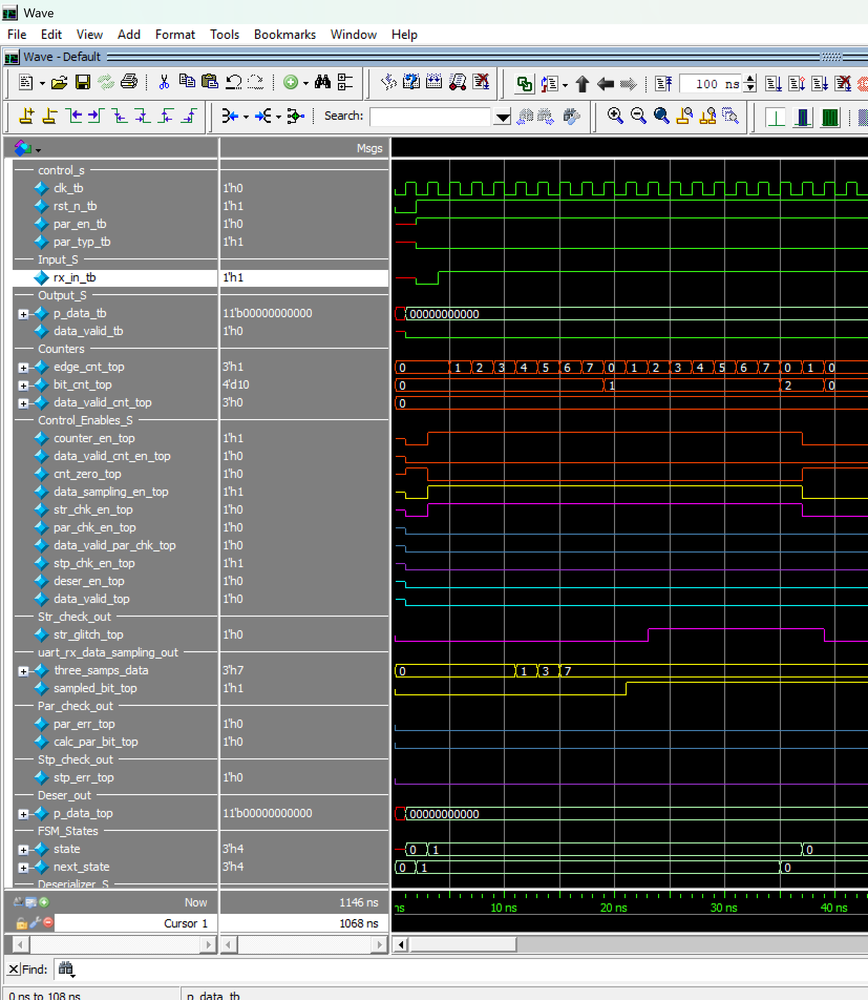
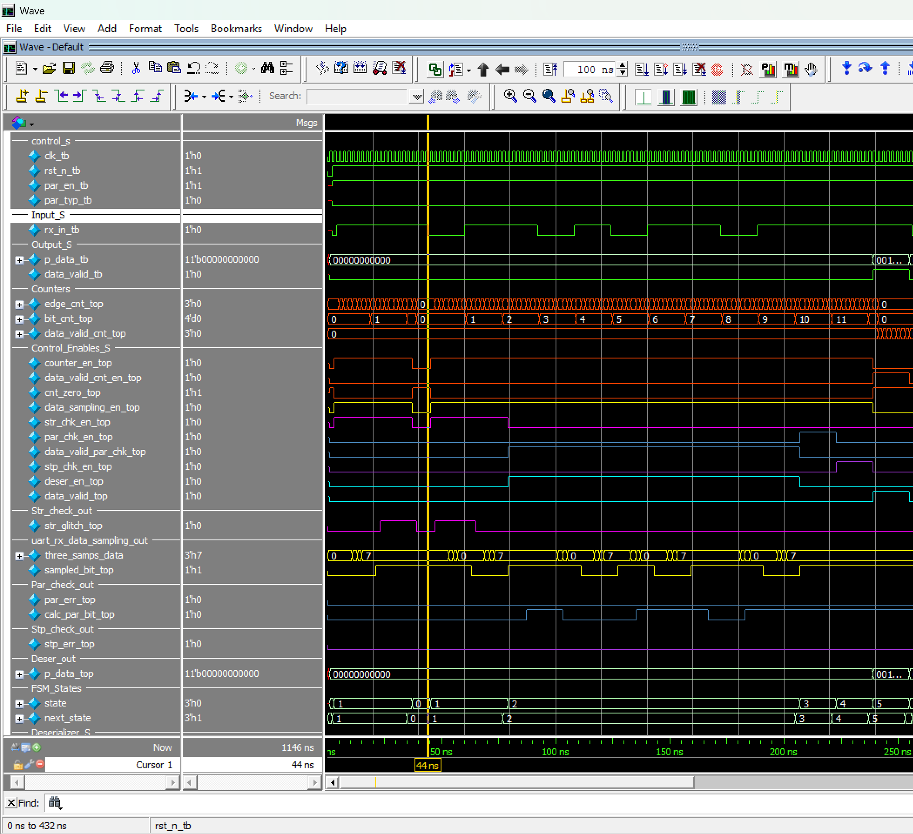
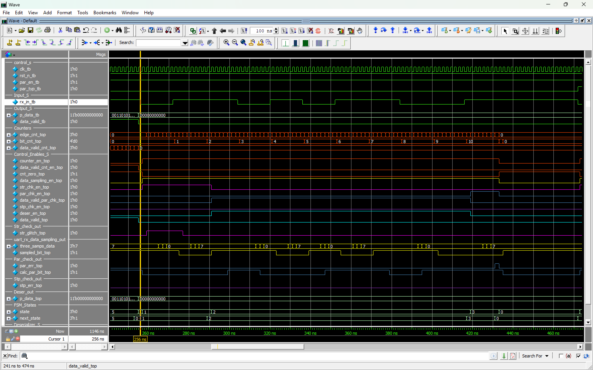
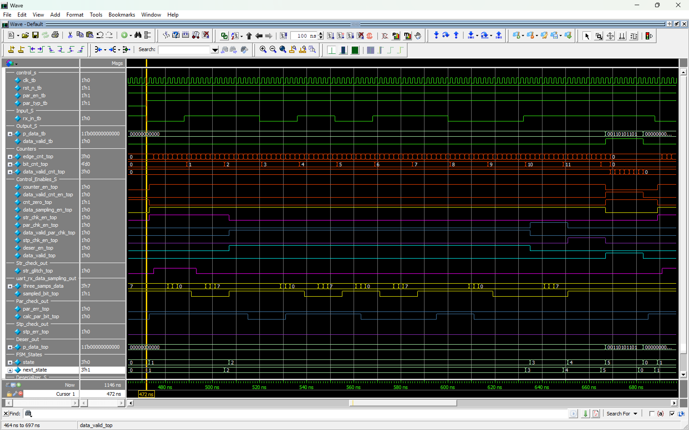
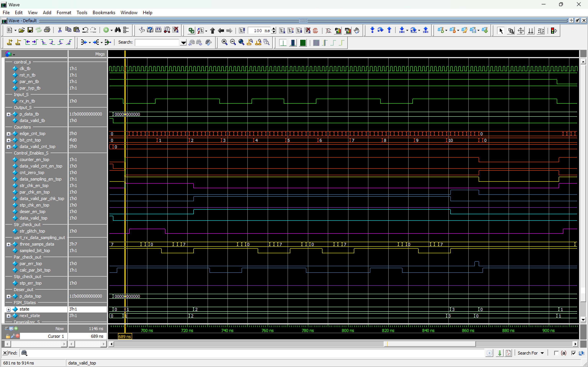
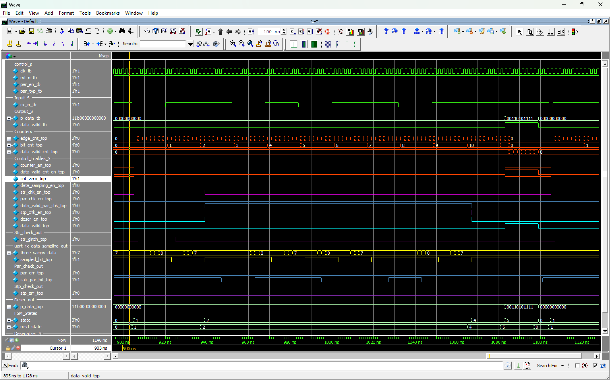
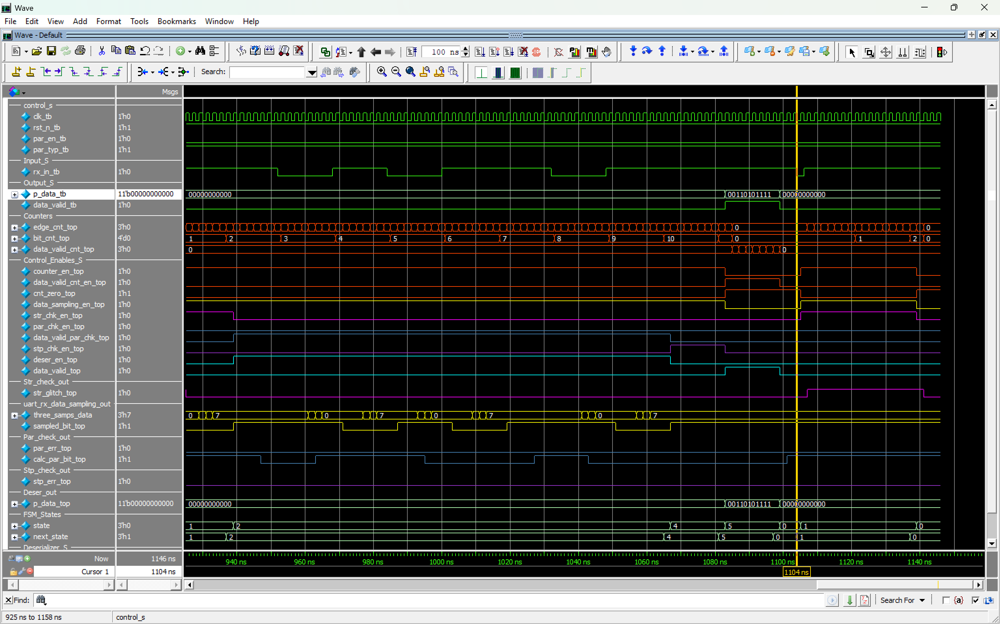

# Waveforms

Captured ModelSim waveform images for all test cases.

---

## Test Case 1 -- Start Glitch Rejection



**Configuration**: `PAR_EN = 1`, `PAR_TYP = 0` (even parity)

**Stimulus**: `RX_IN` is driven low for 1 clock cycle, then back high for 20 cycles.

**Expected Behavior**: The falling edge of `RX_IN` moves the FSM to `START_CHECK`. The start candidate is oversampled; the majority-sampled value is high, so `STR_GLITCH` is asserted and the FSM returns to `IDLE`. No frame is processed, `P_DATA` stays `0`, and `DATA_VALID` stays low.

---

## Test Case 2 -- Even Parity (Correct Frame)



**Configuration**: `PAR_EN = 1`, `PAR_TYP = 0`, data `8'b0110_1011` (0x6B)

**Expected Frame** (11 bits):

```
Start(0) | 1 | 1 | 0 | 1 | 0 | 1 | 1 | 0 | Parity(1) | Stop(1)
```

_(data bits driven LSB first: `bit0=1, bit1=1, bit2=0, bit3=1, bit4=0, bit5=1, bit6=1, bit7=0`)_

Data has 5 ones (odd count), so the even parity bit = 1 to make the total even. The FSM passes through `START_CHECK` -> `DATA_PROCESS` -> `PAR_CHECK` -> `STP_CHECK` -> `DATA_OUT`. `PAR_ERR` and `STP_ERR` stay low. `DATA_VALID` pulses high for 8 clock cycles and `P_DATA` outputs the reconstructed frame.

A zoomed view of this case is also provided in [testcase-2-out.png](testcase-2-out.png).

---

## Test Case 3 -- Even Parity (Wrong Parity Bit)



**Configuration**: `PAR_EN = 1`, `PAR_TYP = 0`, data `8'b0110_1011` (0x6B)

**Expected Frame** (11 bits):

```
Start(0) | 1 | 1 | 0 | 1 | 0 | 1 | 1 | 0 | Parity(0) | Stop(1)
```

The received parity bit is `0`, but even parity requires `1`. During `PAR_CHECK` the parity comparator asserts `PAR_ERR`, and the FSM returns directly to `IDLE`. The frame is discarded: `P_DATA` stays `0` and `DATA_VALID` is never asserted.

---

## Test Case 4 -- Odd Parity (Correct Frame)



**Configuration**: `PAR_EN = 1`, `PAR_TYP = 1`, data `8'b0110_1011` (0x6B)

**Expected Frame** (11 bits):

```
Start(0) | 1 | 1 | 0 | 1 | 0 | 1 | 1 | 0 | Parity(0) | Stop(1)
```

Data has 5 ones (odd count), so the odd parity bit = 0 to keep the total odd. The FSM completes the full sequence and asserts `DATA_VALID` for 8 clock cycles with the reconstructed frame on `P_DATA`.

---

## Test Case 5 -- Odd Parity (Wrong Parity Bit)



**Configuration**: `PAR_EN = 1`, `PAR_TYP = 1`, data `8'b0110_1011` (0x6B)

**Expected Frame** (11 bits):

```
Start(0) | 1 | 1 | 0 | 1 | 0 | 1 | 1 | 0 | Parity(1) | Stop(1)
```

The received parity bit is `1`, but odd parity requires `0`. `PAR_ERR` is asserted during `PAR_CHECK` and the FSM returns to `IDLE`. The frame is discarded: `P_DATA` stays `0` and `DATA_VALID` is never asserted.

---

## Test Case 6 -- No Parity



**Configuration**: `PAR_EN = 0`, `PAR_TYP = 1`, data `8'b0110_1011` (0x6B)

**Expected Frame** (10 bits):

```
Start(0) | 1 | 1 | 0 | 1 | 0 | 1 | 1 | 0 | Stop(1)
```

No parity bit is inserted or checked. `DATA_PROCESS` transitions directly to `STP_CHECK` (`bit_cnt == 10`). The FSM completes the frame and asserts `DATA_VALID` for 8 clock cycles with the reconstructed frame on `P_DATA`. Parity type is irrelevant when parity is disabled.

---

## Test Case 7 -- Start Glitch Rejection (Repeated)



**Configuration**: `PAR_EN = 1`, `PAR_TYP = 0` (even parity)

**Stimulus**: `RX_IN` is driven low for 1 clock cycle, then back high for 20 cycles.

**Expected Behavior**: Identical to Test Case 1. `STR_GLITCH` is asserted and the FSM returns to `IDLE` without processing a frame. Confirms the start-check path still rejects glitches after multiple frame receptions.

---

## How to Capture Waveforms

1. Run simulation: `do run.tcl`
2. Load waveform config: `do wave.do`
3. Run to completion: `run -all`
4. In ModelSim: File > Export > Image (or screenshot the wave window)

---

[< Back to Simulation](../)
