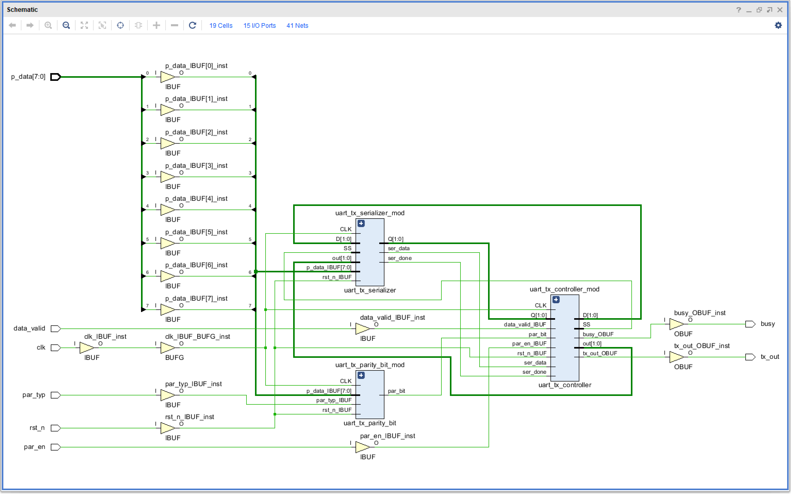
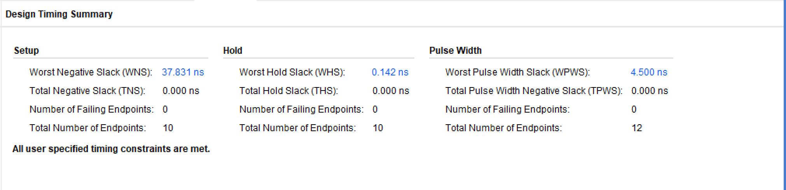
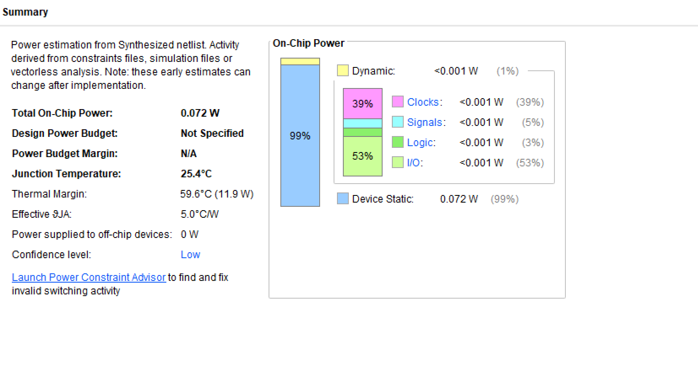

# Synthesis Reports

Post-synthesis analysis of the UART_TX design.

**Tool**: Vivado v.2018.2
**Device**: xc7a35tcpg236-1
**Design State**: Synthesized

---

## Utilization

| Resource | Used | Available | Utilization |
|----------|------|-----------|-------------|
| Slice LUTs | 19 | 20,800 | 0.09% |
| Slice Registers (FFs) | 11 | 41,600 | 0.03% |
| Block RAM | 0 | 50 | 0.00% |
| DSP | 0 | 90 | 0.00% |
| Bonded IOB | 15 | 106 | 14.15% |
| BUFGCTRL | 1 | 32 | 3.13% |

### Register Breakdown

| Type | Count |
|------|-------|
| Clock Enable + Async Reset | 5 |
| Clock Enable + Sync Reset | 5 |
| Clock Enable + Sync Set | 1 |
| **Total** | **11** |

### Primitives

| Primitive | Used | Category |
|-----------|------|----------|
| IBUF | 13 | I/O |
| OBUF | 2 | I/O |
| LUT6 | 6 | Logic |
| LUT5 | 3 | Logic |
| LUT4 | 6 | Logic |
| LUT3 | 3 | Logic |
| LUT1 | 1 | Logic |
| FDRE | 5 | Flip-Flop |
| FDCE | 5 | Flip-Flop |
| FDSE | 1 | Flip-Flop |
| BUFG | 1 | Clock |

---

## Timing Summary

| Metric | Value |
|--------|-------|
| WNS (Worst Negative Slack) | 37.831 ns |
| TNS (Total Negative Slack) | 0.000 ns |
| WHS (Worst Hold Slack) | 0.142 ns |
| THS (Total Hold Slack) | 0.000 ns |
| WPWS (Worst Pulse Width Slack) | 4.500 ns |
| Timing Constraints | All MET |
| Failing Endpoints | 0 |

Clock: `sys_clk_pin` at 25 MHz (40 ns period)

---

## Power Summary

| Metric | Value |
|--------|-------|
| Total On-Chip Power | 0.072 W |
| Dynamic Power | < 0.001 W |
| Device Static Power | 0.072 W |
| Junction Temperature | 25.4 C |
| Max Ambient | 84.6 C |

### By Hierarchy

| Module | Power |
|--------|-------|
| `uart_tx` | < 0.001 W |
| `uart_tx_controller_mod` | < 0.001 W |
| `uart_tx_parity_bit_mod` | < 0.001 W |
| `uart_tx_serializer_mod` | < 0.001 W |

---

## Images

### Utilization & Schematic

### Timing Summary

### Power Summary

---

## Report Files

| File | Description |
|------|-------------|
| `utilization.rpt` | Full utilization report |
| `timing_report.rpt` | Full timing report with path details |
| `power.rpt` | Full power report |
| `Schematic.png` | Synthesis schematic screenshot |
| `Timing_summary.png` | Timing summary screenshot |
| `power_summary.png` | Power summary screenshot |

---

[< Back to FPGA Flow](../)
