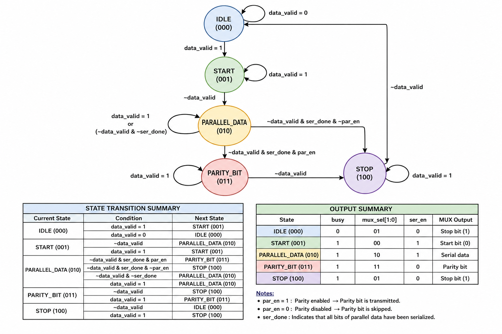
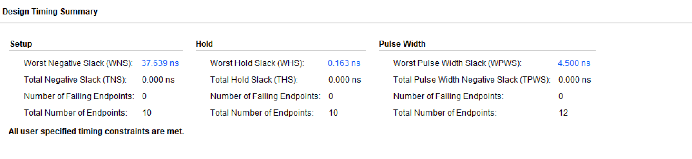
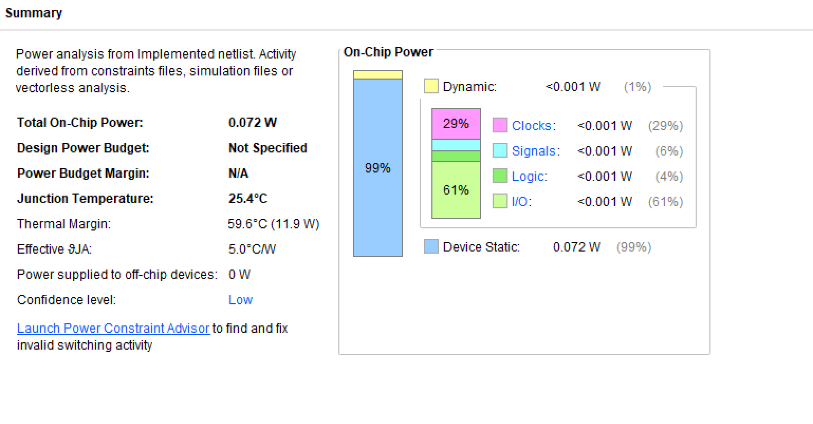
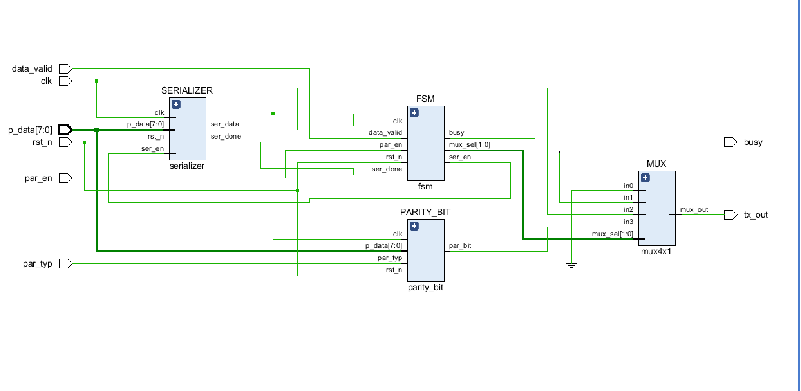
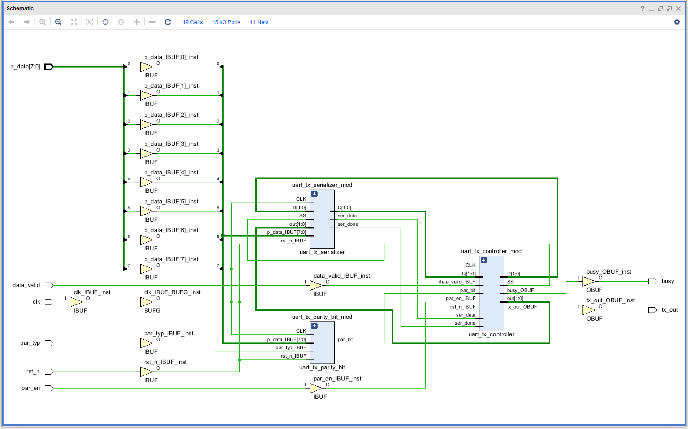
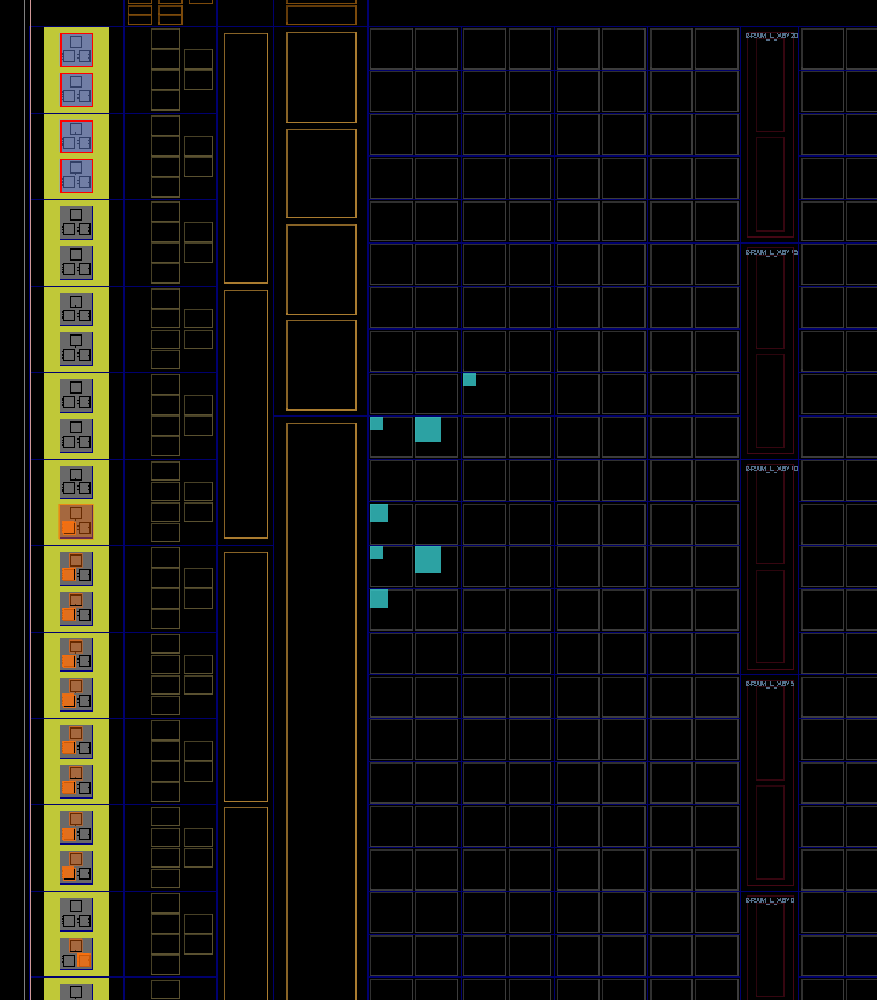

# UART Transmitter (UART_TX)

A parameterizable 8-bit UART Transmitter designed in Verilog HDL, featuring a 5-state FSM, LSB-first serialization, configurable even/odd parity, and full FPGA implementation targeting the Digilent Basys3 board.

---

## Features

- 8-bit parallel-to-serial data transmission
- 5-state FSM-based control architecture
- LSB-first bit ordering
- Configurable parity: **even** (`PAR_TYP=0`) and **odd** (`PAR_TYP=1`)
- Parity enable/disable via `PAR_EN` input
- 1-clock-cycle-per-bit timing (baud = clock frequency)
- Asynchronous active-low reset
- `BUSY` status output for host handshaking
- Data rejection while transmitting (no internal FIFO needed)
- Idle line driven high when not transmitting
- Fully verified with 6 directed test cases
- Synthesized and implemented on Xilinx Artix-7 (xc7a35tcpg236-1)

---

## Project Overview

**UART** (Universal Asynchronous Receiver/Transmitter) is a widely used serial communication protocol for point-to-point data exchange. It operates without a shared clock line, relying on agreed-upon frame conventions between transmitter and receiver.

This project implements the **transmitter half** of a UART link. It accepts an 8-bit parallel data word from a host and serializes it into a standard UART frame consisting of:

1. A **start bit** (logic 0) to signal the beginning of a transfer
2. **8 data bits** transmitted LSB first
3. An optional **parity bit** for single-bit error detection
4. A **stop bit** (logic 1) to signal the end of the transfer

The design uses a **one-clock-cycle-per-bit** timing scheme. Each bit occupies exactly one rising clock edge. No oversampling clock divider or fractional baud rate generator is used. This makes the design ideal for FPGA implementations where the system clock can be directly mapped to the desired baud rate, or for educational purposes where understanding the UART frame structure is the primary goal.

---

## UART Frame Format

### With Parity Enabled (`PAR_EN = 1`)

```
+--------+--------+--------+--------+--------+--------+--------+--------+--------+-----------+--------+
|  Start |  D[0]  |  D[1]  |  D[2]  |  D[3]  |  D[4]  |  D[5]  |  D[6]  |  D[7]  |  Parity   |  Stop  |
|  (1b)  |  (1b)  |  (1b)  |  (1b)  |  (1b)  |  (1b)  |  (1b)  |  (1b)  |  (1b)  |   (1b)    |  (1b)  |
|  Logic 0| LSB  ->  ->  ->  ->  ->  ->  ->  MSB| Computed| Logic 1|
+--------+--------+--------+--------+--------+--------+--------+--------+--------+-----------+--------+
|<--------------------------- 11 Clock Cycles -------------------------------------->|
```

### Without Parity (`PAR_EN = 0`)

```
+--------+--------+--------+--------+--------+--------+--------+--------+--------+--------+
|  Start |  D[0]  |  D[1]  |  D[2]  |  D[3]  |  D[4]  |  D[5]  |  D[6]  |  D[7]  |  Stop  |
|  (1b)  |  (1b)  |  (1b)  |  (1b)  |  (1b)  |  (1b)  |  (1b)  |  (1b)  |  (1b)  |  (1b)  |
|  Logic 0| LSB  ->  ->  ->  ->  ->  ->  ->  MSB|          Logic 1          |
+--------+--------+--------+--------+--------+--------+--------+--------+--------+--------+
|<----------------------------- 10 Clock Cycles ---------------------------------------->|
```

### Parity Bit Computation

| Mode | `PAR_TYP` | Parity Bit Value |
|------|-----------|------------------|
| **Even** | `0` | XOR reduction of `P_DATA`. Ensures total 1-bits in data+parity is even. |
| **Odd** | `1` | XNOR reduction of `P_DATA`. Ensures total 1-bits in data+parity is odd. |

---

## Project Architecture

### RTL Hierarchy

```
uart_tx (Top Level)
|
+-- uart_tx_controller          FSM + output decode
|   +-- State Memory            3-bit registered state
|   +-- Next-State Logic        Combinational transition logic
|   +-- Output Logic            MUX select, busy, serializer enable
|
+-- uart_tx_serializer          Parallel-to-serial converter
|   +-- 3-bit counter           Tracks bit position (0-7)
|   +-- Data register           Shifts out P_DATA[counter]
|   +-- Done detector           Asserts ser_done when counter == 7
|
+-- uart_tx_parity_bit          Parity calculator
|   +-- XOR / XNOR logic        Computes even or odd parity on P_DATA
|
+-- uart_tx_mux4x1              Output multiplexer
    +-- 4:1 MUX                 Selects Start / Stop / Data / Parity for TX_OUT
```

### Module Interconnection

```
                    +----------------------+
   P_DATA [7:0] ----|                      |---- ser_data
   DATA_VALID  -----|  uart_tx_serializer |---- ser_done
   SER_EN      -----|                      |
                    +----------------------+
                              |
   CLK -----------------------+-----------------------------------------+
   RST_n ---------------------+-----------------------------------------+
                              |
                    +----------------------+
   DATA_VALID ------|                      |
   PAR_EN     ------|  uart_tx_controller |
   SER_DONE   ------|                      |
                    +----------------------+
                     |            |
                     | MUX_SEL    | SER_EN
                     |            |
                    +----------------------+
   P_DATA [7:0] ----|                      |
   PAR_TYP     -----|  uart_tx_parity_bit |
                    +----------------------+
                     |            |
                     | PAR_BIT    |
                     |            |
                    +----------------------------------------+
          in0(0) ----|                                        |
          in1(1) ----|        uart_tx_mux4x1                 |
       ser_data -----|                                        |---- TX_OUT
       par_bit  ----|                                        |
  mux_sel [1:0] ----|                                        |
                    +----------------------------------------+
```

---

## Data Flow

A complete transmission proceeds as follows:

**1. Idle State** -- The controller sits in `IDLE`. `BUSY` is low. `TX_OUT` is driven high (idle line) via MUX select `2'b01` (stop bit = 1).

**2. Data Capture** -- The host asserts `DATA_VALID` for exactly one clock cycle while presenting data on `P_DATA`. The serializer latches `P_DATA`, and the controller transitions to `START`.

**3. Start Bit** -- The controller drives `MUX_SEL = 2'b00`, placing logic 0 on `TX_OUT`. `BUSY` goes high. The serializer begins counting.

**4. Data Transmission** -- The controller transitions to `PARALLEL_DATA`, setting `MUX_SEL = 2'b10`. The serializer outputs `P_DATA[0]` through `P_DATA[7]` one bit per clock cycle, LSB first. `ser_done` is asserted when bit 7 is output.

**5. Parity Bit (optional)** -- If `PAR_EN = 1`, the controller moves to `PARITY_BIT` and drives `MUX_SEL = 2'b11`, placing the precomputed parity bit on `TX_OUT` for one clock cycle.

**6. Stop Bit** -- The controller transitions to `STOP`, driving `MUX_SEL = 2'b01` (logic 1) on `TX_OUT`.

**7. Return to Idle** -- The controller returns to `IDLE`. `BUSY` goes low. The transmitter is ready for the next transfer.

---

## Finite State Machine

The controller implements a **5-state Moore FSM** with registered state and combinational next-state and output logic.

### States

| State | Encoding | Description |
|-------|----------|-------------|
| `IDLE` | `3'b000` | Waiting for valid data. `BUSY=0`, `TX_OUT=1`. |
| `START` | `3'b001` | Transmitting start bit (logic 0). Serializer enabled. |
| `PARALLEL_DATA` | `3'b010` | Transmitting 8 data bits. Serializer outputs one bit per cycle. |
| `PARITY_BIT` | `3'b011` | Transmitting parity bit (if `PAR_EN=1`). |
| `STOP` | `3'b100` | Transmitting stop bit (logic 1). |

### FSM State Diagram



### Output Encoding

| State | `MUX_SEL` | `BUSY` | `SER_EN` | MUX Output |
|-------|-----------|--------|----------|------------|
| `IDLE` | `2'b01` | `0` | `0` | Stop bit (1) |
| `START` | `2'b00` | `1` | `1` | Start bit (0) |
| `PARALLEL_DATA` | `2'b10` | `1` | `1` | Serial data |
| `PARITY_BIT` | `2'b11` | `1` | `0` | Parity bit |
| `STOP` | `2'b01` | `1` | `0` | Stop bit (1) |

---

## Module Descriptions

| Module | File | Description | Key Inputs | Key Outputs |
|--------|------|-------------|------------|-------------|
| `uart_tx` | `rtl/uart_tx.v` | Top-level module. Instantiates and interconnects all sub-modules. | `clk`, `rst_n`, `p_data[7:0]`, `data_valid`, `par_en`, `par_typ` | `tx_out`, `busy` |
| `uart_tx_controller` | `rtl/uart_tx_controller.v` | FSM controller. Manages state transitions, serializer enable, MUX select, and busy signal. | `clk`, `rst_n`, `data_valid`, `par_en`, `ser_done` | `mux_sel[1:0]`, `busy`, `ser_en` |
| `uart_tx_serializer` | `rtl/uart_tx_serializer.v` | 8-bit parallel-to-serial converter. Shifts out data LSB first, asserts `ser_done` after bit 7. | `clk`, `rst_n`, `p_data[7:0]`, `ser_en` | `ser_data`, `ser_done` |
| `uart_tx_parity_bit` | `rtl/uart_tx_parity_bit.v` | Parity calculator registered at clock edge. Computes even or odd parity on `P_DATA`. | `clk`, `rst_n`, `p_data[7:0]`, `par_typ` | `par_bit` |
| `uart_tx_mux4x1` | `rtl/uart_tx_mux4x1.v` | 4-to-1 output multiplexer. Selects between start, stop, data, and parity bits. | `in0`, `in1`, `in2`, `in3`, `mux_sel[1:0]` | `mux_out` |

---

## Timing

| Parameter | Value |
|-----------|-------|
| System Clock | 25 MHz (Basys3 onboard oscillator, pin W5) |
| Clock Period | 40 ns |
| Bit Duration | 1 clock cycle = 40 ns |
| Effective Baud Rate | 25 Mbaud (direct clock mapping) |
| Oversampling | None (1x clock) |
| Frame Duration (no parity) | 10 clock cycles = 400 ns |
| Frame Duration (with parity) | 11 clock cycles = 440 ns |

The design uses **one clock cycle per bit** with no clock divider or oversampling. The baud rate equals the system clock frequency. For standard UART baud rates (9600, 115200, etc.), a clock divider or PLL-generated baud clock would be required externally.

---

## Interface

| Port | Direction | Width | Description |
|------|-----------|-------|-------------|
| `clk` | Input | 1 | System clock (25 MHz on Basys3) |
| `rst_n` | Input | 1 | Asynchronous active-low reset |
| `p_data` | Input | 8 | Parallel data byte to transmit |
| `data_valid` | Input | 1 | Pulse to initiate transmission (1 clock cycle) |
| `par_en` | Input | 1 | Parity enable: `1` = include parity bit |
| `par_typ` | Input | 1 | Parity type: `0` = even, `1` = odd |
| `tx_out` | Output | 1 | Serial transmit output |
| `busy` | Output | 1 | High during active transmission |

---

## Simulation

### Simulator

The design was simulated using **Mentor Graphics ModelSim** (Intel FPGA Edition). The simulation script (`sim/run.tcl`) compiles all RTL sources and the testbench, then runs the full simulation to completion.

### How to Run Simulation

```tcl
# From the sim/ directory in ModelSim:
do run.tcl
```

Or manually in the ModelSim console:

```tcl
quit -sim
vlib work
vlog "uart_tx_tb.v"
vlog "../rtl/uart_tx.v"
vlog "../rtl/uart_tx_serializer.v"
vlog "../rtl/uart_tx_parity_bit.v"
vlog "../rtl/uart_tx_mux4x1.v"
vlog "../rtl/uart_tx_controller.v"
vsim -voptargs=+acc uart_tx_tb
run -all
```

### Testbench Strategy

The testbench (`sim/uart_tx_tb.v`) applies **6 directed test cases** covering all supported frame configurations and boundary conditions. Each test case asserts `DATA_VALID` for one clock cycle, waits 11 clock cycles for completion, and prints a status message to the console.

| Test Case | Data (`P_DATA`) | `PAR_EN` | `PAR_TYP` | Description |
|-----------|-----------------|----------|-----------|-------------|
| 1 | `8'b0110_1110` (0x6E) | 1 | 0 | Even parity. 5 ones in data -> parity = 1. |
| 2 | `8'b0110_0010` (0x62) | 1 | 1 | Odd parity. 3 ones in data -> parity = 0. |
| 3 | `8'b0100_1010` (0x4A) | 0 | 0 | No parity. 10-bit frame. |
| 4 | `8'b0001_1100` (0x1C) | 0 | 1 | No parity (parity type irrelevant). |
| 5 | `8'b0011_1110` (0x3E) | 0 | 1 | `DATA_VALID=0`. No transmission initiated. |
| 6 | `8'b0011_1110` (0x3E) | 1 | 1 | `DATA_VALID=0` with parity enabled. No transmission. |

### Waveform -- All Test Cases


---

## FPGA Implementation

### Target Device

| Parameter | Value |
|-----------|-------|
| FPGA Part | `xc7a35tcpg236-1` |
| Board | Digilent Basys3 |
| Package | CPG236 |
| Speed Grade | -1 |
| Tool | Vivado v.2018.2 |
| Clock Constraint | 40.0 ns (25 MHz) |

### Device Utilization (Post-Implementation)

| Resource | Used | Available | Utilization |
|----------|------|-----------|-------------|
| Slice LUTs | 19 | 20,800 | 0.09% |
| Slice Registers (FFs) | 11 | 41,600 | 0.03% |
| Block RAM | 0 | 50 | 0.00% |
| DSP | 0 | 90 | 0.00% |
| Bonded IOB | 15 | 106 | 14.15% |
| BUFGCTRL | 1 | 32 | 3.13% |

### Timing Summary (Post-Implementation)

| Metric | Value |
|--------|-------|
| WNS (Worst Negative Slack) | **37.639 ns** |
| TNS (Total Negative Slack) | 0.000 ns |
| WHS (Worst Hold Slack) | 0.163 ns |
| THS (Total Hold Slack) | 0.000 ns |
| WPWS (Worst Pulse Width Slack) | 4.500 ns |
| Timing Constraints | **All MET** |
| Failing Endpoints | 0 |



### Power Summary (Post-Implementation)

| Metric | Value |
|--------|-------|
| Total On-Chip Power | 0.072 W |
| Dynamic Power | < 0.001 W |
| Device Static Power | 0.072 W |
| Junction Temperature | 25.4 C |
| Max Ambient | 84.6 C |



### DRC Results

Zero violations found. Clean design rule check.

### Basys3 Pin Mapping

| Signal | Pin | I/O Standard | Board Element |
|--------|-----|--------------|---------------|
| `clk` | W5 | LVCMOS33 | Oscillator (25 MHz) |
| `rst_n` | U18 | LVCMOS33 | CPU Reset Button |
| `p_data[0]` | V17 | LVCMOS33 | Switch SW0 |
| `p_data[1]` | V16 | LVCMOS33 | Switch SW1 |
| `p_data[2]` | W16 | LVCMOS33 | Switch SW2 |
| `p_data[3]` | W17 | LVCMOS33 | Switch SW3 |
| `p_data[4]` | W15 | LVCMOS33 | Switch SW4 |
| `p_data[5]` | V15 | LVCMOS33 | Switch SW5 |
| `p_data[6]` | W14 | LVCMOS33 | Switch SW6 |
| `p_data[7]` | W13 | LVCMOS33 | Switch SW7 |
| `data_valid` | T3 | LVCMOS33 | Switch SW8 |
| `par_en` | T2 | LVCMOS33 | Switch SW9 |
| `par_typ` | R3 | LVCMOS33 | Switch SW10 |
| `tx_out` | U16 | LVCMOS33 | LED LD0 |
| `busy` | E19 | LVCMOS33 | LED LD8 |

---

## Results

### RTL Elaboration (Vivado)



### Post-Implementation Schematic



### Device View (Post-Placement & Routing)



### Synthesis Timing Summary


### Synthesis Schematic


### Synthesis Power Summary


---

## Project Directory

```
uart_tx_top/
|
+-- rtl/
|   +-- uart_tx.v                    Top-level module
|   +-- uart_tx_controller.v         FSM controller
|   +-- uart_tx_serializer.v         Parallel-to-serial converter
|   +-- uart_tx_parity_bit.v         Parity calculator
|   +-- uart_tx_mux4x1.v            4:1 output multiplexer
|   +-- Snippets/
|       +-- FSM_analysis.png         FSM state diagram
|       +-- RTL_elaboration.png      RTL elaboration screenshot
|
+-- sim/
|   +-- uart_tx_tb.v                 Testbench (6 test cases)
|   +-- run.tcl                      ModelSim simulation script
|   +-- wave.do                      ModelSim waveform configuration
|   +-- uart_tx_sim.mpf              ModelSim project file
|   +-- Waveforms/
|       +-- all.png                  All test cases waveform
|       +-- Testcase-1 waveform.png  Even parity waveform
|       +-- Testcase-2 waveform.png  Odd parity waveform
|       +-- Testcase-3 waveform.png  No parity waveform
|       +-- Testcase-4 waveform.png  No parity waveform
|       +-- Testcase-5-6 waveform.png  DATA_VALID disabled waveform
|
+-- specifications/
|   +-- UART_TX_Specification.md     Design specification document
|
+-- FPGA_Flow/
|   +-- constraints_basys3.xdc       Basys3 FPGA constraints
|   +-- Synthesis/
|   |   +-- utilization.rpt          Synthesis utilization report
|   |   +-- timing_report.rpt        Synthesis timing report
|   |   +-- power.rpt                Synthesis power report
|   |   +-- Schematic.png            Synthesis schematic
|   |   +-- Timing_summary.png       Synthesis timing summary
|   |   +-- power_summary.png        Synthesis power summary
|   +-- Implementation/
|   |   +-- utilization.rpt          Post-implementation utilization report
|   |   +-- timing_report.rpt        Post-implementation timing report
|   |   +-- power.rpt                Post-implementation power report
|   |   +-- DRC.rpt                  Design rule check report
|   |   +-- Schematic.png            Post-implementation schematic
|   |   +-- Device.png               Device view
|   |   +-- Timing_summary.png       Post-implementation timing summary
|   |   +-- Power_summary.png        Post-implementation power summary
|   +-- uart_tx/
|       +-- uart_tx.xpr              Vivado project file
|       +-- uart_tx.cache/           Vivado cache
|       +-- uart_tx.runs/            Synthesis & implementation runs
|
+-- README.md
```

---

## How to Run

### Simulation (ModelSim)

1. Open ModelSim
2. Navigate to the `sim/` directory
3. Run the Tcl script:
   ```tcl
   do run.tcl
   ```
4. Waveforms will be available in the ModelSim wave viewer
5. Console output will display pass/fail status for all 6 test cases

### Synthesis & Implementation (Vivado)

1. Open Vivado 2018.2
2. Create or open the project:
   - Open `FPGA_Flow/uart_tx/uart_tx.xpr`
   - Or create a new project targeting `xc7a35tcpg236-1`
3. Add all RTL sources from `rtl/`
4. Add the constraint file `FPGA_Flow/constraints_basys3.xdc`
5. Run Synthesis:
   ```tcl
   synth_design -top uart_tx
   ```
6. Run Implementation:
   ```tcl
   opt_design
   place_design
   route_design
   ```
7. Generate Bitstream:
   ```tcl
   write_bitstream -file uart_tx.bit
   ```
8. Program the Basys3 board via Vivado Hardware Manager

---

## Design Decisions

### Why One-Clock-Per-Bit?

The design intentionally maps each UART bit to exactly one clock cycle. This eliminates the need for an internal baud rate generator and keeps the RTL simple and easy to understand. For production UART IP cores, an oversampling scheme (typically 16x) would be used to tolerate clock mismatch between transmitter and receiver.

### Why a 4:1 MUX at the Output?

A single output MUX consolidates all frame components (start, data, parity, stop) into one selectable path. The FSM drives a 2-bit `MUX_SEL` signal, making the output logic clean and the controller's output encoding trivial to verify.

### Why Separate Parity Calculator?

The parity bit is computed combinationally from `P_DATA` and registered on the clock edge. Keeping it in a separate module makes the design modular and allows easy modification (e.g., CRC instead of parity) without touching the controller or serializer.

### Why No Clock Divider?

The Basys3 25 MHz clock is used directly. Each bit occupies 40 ns. This is sufficient for functional verification and demonstration purposes. In a real system, a baud rate generator or PLL would be instantiated to produce the correct baud clock.

### Why `DATA_VALID` Checks in Every State?

The FSM checks `DATA_VALID` in every state as a guard against re-triggering. If the host erroneously holds `DATA_VALID` high during transmission, the FSM remains in its current state rather than re-entering the start sequence. This is a simple but effective robustness measure.

