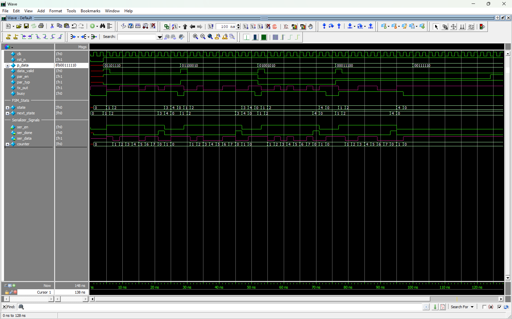

# Waveforms

Captured ModelSim waveform images for all test cases.

---

## All Test Cases



Complete waveform showing all 6 test cases executed sequentially. The top section shows top-level signals (clk, rst_n, p_data, data_valid, par_en, par_typ, tx_out, busy). The bottom sections show internal FSM states, controller signals, and serializer signals.

---

## Test Case 1 -- Even Parity


**Configuration**: `P_DATA = 8'b0110_1110`, `PAR_EN = 1`, `PAR_TYP = 0`

**Expected Frame** (11 bits):
```
Start(0) | 0 | 1 | 1 | 0 | 1 | 1 | 1 | 0 | Parity(1) | Stop(1)
```

Data has 5 ones (odd count), so even parity bit = 1 to make total even.

---

## Test Case 2 -- Odd Parity


**Configuration**: `P_DATA = 8'b0110_0010`, `PAR_EN = 1`, `PAR_TYP = 1`

**Expected Frame** (11 bits):
```
Start(0) | 0 | 1 | 0 | 0 | 0 | 1 | 1 | 0 | Parity(0) | Stop(1)
```

Data has 3 ones (odd count), so odd parity bit = 0 to keep total odd.

---

## Test Case 3 -- No Parity


**Configuration**: `P_DATA = 8'b0100_1010`, `PAR_EN = 0`, `PAR_TYP = 0`

**Expected Frame** (10 bits):
```
Start(0) | 0 | 1 | 0 | 1 | 0 | 0 | 1 | 0 | Stop(1)
```

No parity bit inserted. Frame is one cycle shorter.

---

## Test Case 4 -- No Parity


**Configuration**: `P_DATA = 8'b0001_1100`, `PAR_EN = 0`, `PAR_TYP = 1`

**Expected Frame** (10 bits):
```
Start(0) | 0 | 0 | 1 | 1 | 1 | 0 | 0 | 0 | Stop(1)
```

Same as TC3 but with different data. Parity type is irrelevant when parity is disabled.

---

## Test Cases 5 & 6 -- DATA_VALID Disabled


**Configuration (TC5)**: `P_DATA = 8'b0011_1110`, `PAR_EN = 0`, `PAR_TYP = 1`, `DATA_VALID = 0`
**Configuration (TC6)**: `P_DATA = 8'b0011_1110`, `PAR_EN = 1`, `PAR_TYP = 1`, `DATA_VALID = 0`

**Expected Behavior**: No transmission is initiated. The FSM remains in IDLE state. `BUSY` stays low. `TX_OUT` stays high (idle line). This verifies that the design correctly requires `DATA_VALID` to be asserted for transmission to begin.

---

## How to Capture Waveforms

1. Run simulation: `do run.tcl`
2. Load waveform config: `do wave.do`
3. Run to completion: `run -all`
4. In ModelSim: File > Export > Image (or screenshot the wave window)

---

[< Back to Simulation](../)
